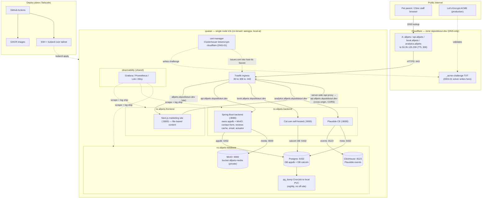

# allpets — System Architecture (HLD)

> **File owner:** 19.1 (supersedes 17.1 — one `architecture.md` owner). · **Area:** `area:docs` · **Repo:** `allpets-backend`.
>
> **Status:** **Revised 2026-06-17 for the Spring-backend pivot (supersedes the Payload-centric baseline).** Originally baselined 2026-06-15, authored **after Epics 2–4 shipped** so Epics 5–13 build against a written design. This is the **conceptual spine**; the component-level detail lives in the two LLDs ([19.2 Backend LLD](./lld-backend.md), [19.3 Frontend LLD](../../allpets-frontend/planning/lld-frontend.md)).
>
> **Source of truth:** this doc describes the **decided + already-deployed** reality of Rev 1–5 and Epics 2–4, as amended by the **2026-06-17 pivot** — never early assumptions. Where this doc and an older spec disagree, the **2026-06-17 pivot + 2026-06-15 owner decisions + cluster verification (including the live manifests in `deploy/k8s/`) win**. The detailed runbooks and ADRs it summarizes:
> - Deploy/ops runbook → [`planning/deployment.md`](./deployment.md)
> - Data-tier decision (plain Postgres, no off-site) → [`planning/database-decision.md`](./database-decision.md) (ADR 4.1)
> - Admin-surface decision (app-auth-only) → [`planning/admin-surface-decision.md`](./admin-surface-decision.md) (ADR 3.6)
> - Ingress pattern (Cloudflare + Traefik + cert-manager DNS-01) → [`deploy/k8s/ingress/README.md`](../deploy/k8s/ingress/README.md) (3.4)
> - Requirements → [`planning/requirements.md`](../../planning/requirements.md)
>
> **The 2026-06-17 pivot in one paragraph:** Payload CMS is **dropped entirely**. Marketing content is now **file-based** (typed / MDX content files committed in the `allpets-frontend` repo) — set-and-forget, edited by the operator via Git commit + auto-deploy. The small custom server work (contact-form, Google-reviews cache, transactional email) moves to a **new Spring Boot backend service** in `allpets-backend`, exposed on its **own host** `api.allpets.skpodduturi.dev` and reached by the Next.js site's **server-side `/api` proxy** **cross-origin** (the browser stays same-origin). That Spring service is also the **seed of the phase-2 application** (pet/patient profiles + multi-branch multi-tenancy), though none of phase 2 is built yet.
>
> **What is NOT used (recorded so a reviewer grepping these terms finds only explicit disclaimers):** **No headless CMS / Payload** — marketing content is **file-based** (typed / MDX in `allpets-frontend`), not authored through a CMS or stored in a content database. **Cloudflare** is now the **DNS provider** (it manages the `skpodduturi.dev` zone) but only in **DNS-only ("gray-cloud") mode** — it is **not** a reverse proxy, **not** a Tunnel, and **not** Cloudflare Access (hosts are plain A-records → quasar WAN; "Cloudflare-as-DNS" is **not** "Cloudflare-Access/Tunnel"). **HTTP-01** is not used (cert solver is **DNS-01** via the **Cloudflare** solver; the Epic-3 spec's HTTP-01/port-80 assumption is **superseded**). **CloudNativePG / CNPG** is not used (Postgres is a plain `Deployment` — ADR 4.1). **sealed-secrets / SOPS / external-secrets** are not used in phase 1 (GitHub repo secrets → k8s Secrets at deploy; sealing is **phase-2** hardening). **GitOps** (Flux/Argo + a manifests repo) is not used (CD is **push-based** over Tailscale; GitOps is a phase-2 candidate). A **dedicated clinic server** is not phase-1 (deploy target is the existing `quasar`; the dedicated box is the deferred **phase-2 migration**, Epic 1).

---

## 1. Overview

allpets is the phase-1 website + self-serve appointment scheduler for **All Pets Veterinary Hospital** (single-location clinic, Norman OK). Phase 1 delivers four user-facing capabilities and the infrastructure to run them self-hosted:

1. A **Next.js marketing site** (Home, Services, About, Contact, legal) — credibility + discoverability — whose content is **file-based** (typed / MDX content files committed in `allpets-frontend`).
2. **Self-serve booking** delegated to a self-hosted **Cal.com** instance (no Enterprise Edition), embedded into the site.
3. A small **Spring Boot backend service** that owns the custom glue the site needs: **contact-form submissions** (persist + trigger email), a **Google-reviews cache** (scheduled fetch + serve), **transactional email**, and **health/actuator**. It is also the **seed of the phase-2 application** (pet profiles + multi-tenancy — see §11).
4. **Privacy-respecting analytics** via self-hosted **Plausible Community Edition**.

> **No CMS.** There is **no Payload CMS, no content database, and no content admin UI**. Marketing content is set-and-forget: the operator edits typed / MDX files in `allpets-frontend` and a Git commit auto-deploys the site. This replaces the former Payload-authoring model end to end.

Everything runs as containers on an **existing single-node k3s cluster on `quasar`**, co-tenant with other production workloads (notably **aarogya**, a healthcare prod stack, and **local-ai**). The architecture is deliberately **container-friendly and vendor-neutral**: no managed cloud database, no cloud load balancer, no cloud-only primitive on the request path. The only external clouds in play are **Cloudflare** (DNS + the ACME DNS-01 solver, in DNS-only / gray-cloud mode), **Let's Encrypt** (certificate authority), and **GitHub / GHCR** (CI + image registry) — none of which sit on the live request path.

The system is built around three load-bearing structural ideas, each detailed below:

- **A two-database boundary** — the **Spring app DB** and the **Cal.com DB** each own a separate logical database on one Postgres server and **never share rows** (req §7). Marketing content is **not** in a database (it is files).
- **A three-namespace topology** with **default-deny ingress** NetworkPolicies and explicit allows — frontend, backend, and database tiers are isolated and only the expected paths are open. **The deployed policy permits only `allpets-backend` to reach the data tier; `allpets-frontend` has no data-tier access** (§5).
- **Two orthogonal planes** — a **public-ingress plane** (Traefik on :80/:443, reached over the internet) and a **deploy plane** (GitHub Actions → GHCR → `kubectl` over Tailscale). Neither replaces the other; they share the box but not the path.

### Where the Spring backend runs (resolved fact, reconciled to the deployed substrate)

The **Spring Boot backend process runs in `allpets-backend`** — alongside Cal.com and Plausible — and it is **the Spring service (in `allpets-backend`)** that connects to the `appdb` database and to MinIO. This matches the deployed substrate:

- `deploy/k8s/networkpolicies/backend-database.yaml` opens the data tier **only** to `allpets-backend` (`allow-from-backend`: namespaceSelector `allpets-backend` → Postgres 5432 / MinIO 9000 / ClickHouse 8123). There is **no `allow-from-frontend` policy on `allpets-database`**, and the frontend repo's only NetworkPolicy (`allpets-frontend/deploy/k8s/networkpolicy.yaml`) makes **no reference to `allpets-database`**.
- The Next.js site does **not** call the Spring backend over the in-cluster `allow-from-frontend` path. The pivot makes the API a **first-class public host** (`api.allpets.skpodduturi.dev`); the **browser stays same-origin** — it calls a **Next.js route-handler proxy** (`/api/contact`, `/api/reviews` on `allpets.skpodduturi.dev`) whose **server-side** fetch reaches the Spring host **cross-origin** over the public-ingress plane (CORS allowlisted for `https://allpets.skpodduturi.dev`). The old `/admin` passthrough and the in-cluster content-API seam are **gone**; the same-origin `/api` proxy is **retained and re-targeted** from Payload to Spring (Frontend LLD §4.2).
- `deployment.md` §1.4 lists the **Spring backend** under `allpets-backend`, and its restore/rotation runbook drives it as `kubectl -n allpets-backend … deploy/allpets-api`.

**`api.allpets.skpodduturi.dev` is a dedicated public host, not a path under the site.** The Spring API is served on its **own origin** (host `api.allpets.skpodduturi.dev`), with its **own Ingress + cert** in `allpets-backend`. The frontend never touches the data tier: the browser calls the site's own same-origin `/api` proxy (which server-side-fetches the Spring API cross-origin), and **only the Spring backend (and Cal.com / Plausible, all in `allpets-backend`) reaches Postgres/MinIO** — the one and only data path the deployed policy permits. An `allpets-frontend → allpets-database` allow is therefore **neither deployed nor needed**.

### Hosts (A-records → `50.35.125.239`, to be created in Cloudflare)

| Host | Serves | Ingress namespace | Process namespace |
|---|---|---|---|
| `allpets.skpodduturi.dev` | Next.js marketing site (file-based content) | `allpets-frontend` (Ingress for the site) | `allpets-frontend` |
| `api.allpets.skpodduturi.dev` | Spring Boot backend API (contact-form, reviews cache, email, actuator) | `allpets-backend` (Ingress + cert + CORS allowlist) | `allpets-backend` |
| `book.allpets.skpodduturi.dev` | Cal.com self-hosted (booking + Cal.com admin) | `allpets-backend` | `allpets-backend` |
| `analytics.allpets.skpodduturi.dev` | Plausible CE dashboard + tracking endpoint | `allpets-backend` | `allpets-backend` |

The Next.js site reaches the Spring API through a **same-origin route-handler proxy** (`/api/*` on `allpets.skpodduturi.dev`) whose **server-side** fetch calls `https://api.allpets.skpodduturi.dev` **cross-origin**; the API's CORS allowlist permits only `https://allpets.skpodduturi.dev` (the proxy's server-side origin). The browser itself never calls the API host directly. Cal.com keeps its **own dedicated host** (never a path under `allpets`) because it needs a stable host for cookies and Google OAuth callbacks (req §9); the Spring API gets its own host for the same reason — clean origin boundary, independent cert, simple CORS.

---

## 2. Component + topology diagram

> Solid arrows are the **live request/data path**; dashed arrows are **control-plane / out-of-band** (cert issuance, observability scrape, deploy). **Note the data-tier paths:** Postgres/MinIO/ClickHouse are reached **only from `allpets-backend`** (Spring backend, Cal.com, Plausible) — this is the only ingress the deployed `allow-from-backend` policy permits. The Next.js site (in `allpets-frontend`) never touches the data tier; it ships **file-based content** in its own image; its **server-side `/api` proxy** calls the **Spring API cross-origin** over the public host `api.allpets.skpodduturi.dev` (the browser stays same-origin). The Spring backend owns all `appdb` + MinIO access. The deploy plane (Tailscale) and the public-ingress plane (Traefik :80/:443) are deliberately separate — see §7.

---

## 3. Components

| Component | Role | Host / endpoint | Namespace | Notes |
|---|---|---|---|---|
| **Next.js marketing site** | Public site (Home, Services, About, Contact, legal). App Router, SSR/SSG, Cal.com embed on `/book` and service CTAs. **Marketing content is file-based** (typed / MDX files committed in `allpets-frontend`). | `allpets.skpodduturi.dev` :3000 | `allpets-frontend` | Content ships **inside the site image** (no content API, no CMS). A **same-origin `/api` route-handler proxy** server-side-fetches the **Spring API** at `api.allpets.skpodduturi.dev` (cross-origin) for contact-form POST + reviews; the browser stays same-origin and **does not** touch Postgres/MinIO directly. |
| **Spring Boot backend** | Custom backend glue: **contact-form** (persist + trigger email), **Google-reviews cache** (scheduled fetch + serve), **transactional email**, **health/actuator**. **Seed of the phase-2 app** (pet profiles + multi-tenancy — §11). Build = **Gradle**; **Java 25 LTS**, latest **Spring Boot 3.x**; **Spring Data JPA + Flyway** migrations; multi-stage **Docker** image → **GHCR**. | `api.allpets.skpodduturi.dev` :8080 | `allpets-backend` | Owns the `appdb` DB (role `app_svc`) + MinIO `allpets-media`, and is the **only** allpets workload that connects to them. Own Ingress + cert (`api-allpets-skpodduturi-dev-tls`); **CORS allowlist** = `https://allpets.skpodduturi.dev`. App-auth-only when admin/auth surfaces arrive (3.6); phase-1 contact/reviews endpoints are public POST/GET, rate-limited. |
| **Cal.com self-hosted** | Booking flow, vet schedules, intake forms, Google Calendar sync, confirmation/reminder email, cancel/reschedule. **No EE** (Cal.diy / Cal.com main without Enterprise). | `book.allpets.skpodduturi.dev` :3000 | `allpets-backend` | Owns the `calcom` DB. Dedicated host for cookies/OAuth. |
| **Plausible CE** | Cookieless, no-PII site analytics + dashboard + tracking script. | `analytics.allpets.skpodduturi.dev` :8000 | `allpets-backend` | Uses its own Postgres metadata (in the shared server) **and** ClickHouse for events. |
| **Postgres 16.x** | One server hosting **two isolated logical databases**: `appdb` and `calcom` (+ Plausible metadata). Plain `Deployment` + PVC + `Service` (not CNPG). | `postgres.allpets-database.svc.cluster.local:5432` | `allpets-database` | Roles `app_svc` / `calcom_app`; cross-DB `CONNECT` revoked. **Ingress allowed only from `allpets-backend`** (§5). See §4. |
| **MinIO** | S3-compatible object store. Phase 1: any site/API media. **Future home for pet-profile photos/documents** (phase 2). Standalone `StatefulSet`. | `http://minio.allpets-database.svc.cluster.local:9000` | `allpets-database` | Bucket `allpets-media` is **private**; the Spring backend uses a **scoped** key, not root; `forcePathStyle: true`. Console :9001 is **not** publicly exposed. Reached only by the Spring backend (from `allpets-backend`). |
| **ClickHouse** | Plausible's event/analytics store (columnar). | :8123 (in-cluster) | `allpets-database` | Backup is the **11.6** seam (port 8123), out of Epic-4 scope. Reached only from `allpets-backend` (Plausible). |
| **pg_dump CronJob** | Nightly logical backup of `appdb` + `calcom` to a **local PVC** (14-day retention). Runs **inside** `allpets-database`. | n/a (`pgdump-pvc`) | `allpets-database` | **No off-site** copy — Backblaze dropped (ADR 4.1). RPO ≈ 24h, no PITR. Reaches Postgres via the intra-namespace allow (§5). |
| **Traefik** (k3s default) | Cluster ingress; TLS termination; HTTP→HTTPS 308 redirect. | :80 / :443 (WAN `50.35.125.239`) | `kube-system` (shared) | `IngressClass traefik`; `allowCrossNamespace` OFF (redirect Middleware is per-namespace). |
| **cert-manager** | Issues + auto-renews Let's Encrypt certs via a dedicated `letsencrypt-cloudflare` ClusterIssuer, **DNS-01 solver (Cloudflare)**. | n/a | `cert-manager` (shared) | Writes `_acme-challenge` TXT into the Cloudflare `skpodduturi.dev` zone, authenticated by the `cloudflare-api-token` secret. |
| **Shared observability** | Grafana + Prometheus + Loki + Alloy (+ kube-state-metrics, node-exporter). **Reused**, not re-deployed. | n/a | `observability` (shared) | allpets logs auto-ship; metrics via kube-state-metrics + a scrape addition. See §10. |

---

## 4. The two-database boundary (Spring app DB vs Cal.com)

Phase 1 has **two application databases that never share rows** (req §7). They live on the **same Postgres server** in `allpets-database`, separated by database name and role, with cross-database access revoked. **Both app databases are reached only from `allpets-backend`** — the Spring backend and Cal.com both run there, and the deployed `allow-from-backend` policy is the only ingress into the data tier. **Marketing content is not in a database at all** — it is file-based in `allpets-frontend`.

| Database | Owner role | Owns | Reached by |
|---|---|---|---|
| `appdb` | `app_svc` | `contact_submissions` (Contact-form inbox), the Google-reviews cache (10.4), and **later** pet/patient profiles + records (phase 2, §11). | The **Spring backend (ns `allpets-backend`)** — the only client of this DB. The Next.js site never queries it; it reaches the Spring API only through its server-side `/api` proxy (cross-origin), never the DB. |
| `calcom` | `calcom_app` | Bookings, vet schedules + date overrides, event types, intake answers, Google-Calendar OAuth tokens, reminder workflows. | The **Cal.com app (ns `allpets-backend`)**. |

> **DB rename from the pivot:** the former `payload` database/role is **renamed** for the Spring app — database **`appdb`**, role **`app_svc`** (DDL-owner of `appdb` only). The `calcom` database/role is **unchanged**. Migrations are managed by **Flyway** (versioned SQL under the Spring repo), applied by the app on startup.

**Isolation is enforced, not just conventional (4.3):** each role has `LOGIN` and full DDL on **its own** database only; `CONNECT` on the *other* database is **revoked**; `CONNECT … FROM PUBLIC` is revoked on both. A `psql` connection as `app_svc` into `calcom` **must be denied** (`FATAL: permission denied for database "calcom"`) — this is verified after every restore.

**They link only by reference, never by shared storage.** The marketing content's service / vet records (file-based, in `allpets-frontend`) carry `calcom_event_type_slug` / `calcom_username` *pointers* to Cal.com objects so the site can deep-link into the correct booking page; no booking data is replicated into `appdb`. The frontend never queries Cal.com's tables — it embeds Cal.com's widget. Staff use **two admin UIs** (Cal.com for bookings; content is edited as files via Git) — a deliberate phase-1 simplification; a unified dashboard is a phase-2 candidate.

Why one server, two databases: a single Postgres `Deployment` is the smallest operational surface on a shared single-node box (ADR 4.1), while role-level isolation gives each app a private blast radius. Plausible additionally keeps its own metadata in this server and its event data in ClickHouse — separate from both app databases.

---

## 5. Three-namespace topology + deployed NetworkPolicies

Workloads are split across **three** allpets namespaces (plus a reserved `allpets-observability`), all labeled `app.kubernetes.io/part-of: allpets`:

| Namespace | Workloads |
|---|---|
| `allpets-frontend` | Next.js marketing site (the only allpets workload here) |
| `allpets-backend` | **Spring Boot backend**, Cal.com, Plausible |
| `allpets-database` | Postgres, MinIO, ClickHouse, nightly `pg_dump` CronJob |
| `allpets-observability` | reserved/empty — observability is **reused** from the shared `observability` namespace (§10) |

> **The Spring backend runs in `allpets-backend`** (reconciled to the deployed manifests — see §1). It is reached by the site's **server-side `/api` proxy** over its **own public host** `api.allpets.skpodduturi.dev` (cross-origin; the browser stays same-origin), and it is the workload from which all `appdb` + MinIO access originates — permitted by `allow-from-backend`. There is **no Payload** in this topology anymore.

### Enforced NetworkPolicy posture

Enforcement is **real** — k3s ships the embedded kube-router NetworkPolicy controller, and it is enabled and verified (a frontend pod is refused DB:5432; a backend pod succeeds; DNS works). The posture is **default-deny *ingress* per namespace + explicit allows**; **egress is left open** so SMTP, Google APIs, GHCR, and DNS continue to work.

Deployed allows (these are the exact policies in `allpets-backend/deploy/k8s/networkpolicies/` and `allpets-frontend/deploy/k8s/networkpolicy.yaml`):

| Flow | Ports | Source → Destination | Policy / Notes |
|---|---|---|---|
| Public traffic in (site) | 3000 | Traefik (`kube-system`) → `allpets-frontend` | `allow-traefik-ingress` (frontend). Next.js site. |
| Public traffic in (backend) | 8080 / 3000 / 8000 | Traefik (`kube-system`) → `allpets-backend` | `allow-traefik-ingress` (backend). **Spring API :8080**, Cal.com :3000, Plausible :8000. The committed ingress port contract. |
| **Backend → data tier** | 5432 / 9000 / 8123 | `allpets-backend` → `allpets-database` | `allow-from-backend`. Postgres / MinIO / ClickHouse. **The only ingress into `allpets-database`. There is no `allpets-frontend → allpets-database` allow — and none is needed, because the DB/object-store clients (Spring backend, Cal.com, Plausible) all run in `allpets-backend`.** |
| Observability scrape | scrape | `observability` → each allpets namespace | `allow-observability-scrape` (present in every allpets ns). Metrics + log discovery. |
| **Intra-namespace → Postgres** (Epic 4) | 5432 | any pod in `allpets-database` → Postgres | **NET-NEW** (`allow-intra-namespace-postgres.yaml`). |
| **Intra-namespace → MinIO** (Epic 4) | 9000 | any pod in `allpets-database` → MinIO | **NET-NEW** (`allow-intra-namespace-minio.yaml`). |

> **The site→API path is public, not in-cluster.** The Spring API is its own public host (`api.allpets.skpodduturi.dev`). The browser stays **same-origin**: it calls the site's `/api/*` route-handler proxy, and the proxy's **server-side** fetch reaches the API **through Traefik** (`allow-traefik-ingress`, :8080) over the public host — **not** over an in-cluster frontend→backend pod path. So there is still **no `allow-from-frontend` policy**: the former in-cluster content-API seam is removed (content is file-based), and the proxy's outbound call rides egress → Traefik like any public client. An in-cluster `allow-from-frontend` allow would only be needed if the proxy were later re-pointed at an in-cluster Service URL; phase 1 deliberately uses the public host instead.
>
> **Why there is no frontend→database allow.** The Next.js site never opens a Postgres/MinIO connection: its marketing content is **file-based** (shipped in its image), and the only dynamic data (contact POST, reviews) comes from the **Spring API** over the public host, fetched **server-side by the site's `/api` proxy** (cross-origin). The Spring backend — running in `allpets-backend` — is the sole client of `appdb` and MinIO (covered by `allow-from-backend`). Keeping the data tier reachable **only** from `allpets-backend` is the deployed, verified posture; opening it to the frontend would widen the blast radius for no functional gain.
>
> **Why the two intra-namespace allows exist.** NetworkPolicy does **not** exempt same-namespace traffic once `default-deny-ingress` (podSelector `{}`) selects a pod. Epic 4's in-namespace `postgres-init` / `minio-setup` Jobs and the nightly `pgdump` CronJob connect to `postgres:5432` / `minio:9000` **inside** `allpets-database` — without these two allows they hang on connect and fail silently (timeout, not error). This is the one place the runbook knowingly deviates from the earlier 2.6 "no new NetworkPolicy needed" note, which only covered the cross-namespace backend→database flow. Both policies are wired into `deploy/k8s/kustomization.yaml` and apply before the workloads.

**Port-contract rule:** the ingress port map (Spring API 8080, Cal.com 3000, Plausible 8000) is pinned to `networkpolicies/backend-database.yaml` (`allow-traefik-ingress`). Change a backend port → update that NetworkPolicy in the **same commit**, or Traefik→pod traffic is dropped.

---

## 6. DNS & TLS

### DNS — Cloudflare (`skpodduturi.dev`)

`skpodduturi.dev` is a **user-owned Cloudflare DNS zone**, authoritative (registrar NS delegation points at Cloudflare's assigned nameservers). The four allpets hosts are **A-records to be created** (not CNAME), in **DNS-only / "gray-cloud" mode** (Cloudflare proxy **OFF**), TTL 300 (or "Auto"), all → **`50.35.125.239`** (quasar's WAN, effectively static — the home/office router statically forwards :80/:443 to Traefik). As of the pivot they are **not yet created** (the zone returns NXDOMAIN); the zone + NS delegation are live, the records are added in the Cloudflare dashboard:

| Host | Type | Target | TTL |
|---|---|---|---|
| `allpets.skpodduturi.dev` | A | `50.35.125.239` | 300 |
| `api.allpets.skpodduturi.dev` | A | `50.35.125.239` | 300 |
| `book.allpets.skpodduturi.dev` | A | `50.35.125.239` | 300 |
| `analytics.allpets.skpodduturi.dev` | A | `50.35.125.239` | 300 |

> **`api.allpets.skpodduturi.dev` is the net-new A-record from the pivot** — same target `50.35.125.239`, same TTL 300; it fronts the Spring backend.

**Cloudflare is the DNS provider, in DNS-only ("gray-cloud") mode — not a reverse proxy, not a Tunnel, not Cloudflare Access.** Records are managed in the Cloudflare dashboard (or via the Cloudflare API); the proxy is left **OFF (gray cloud)** so Traefik, cert-manager, and the 308 redirect behave exactly as before — traffic resolves to the WAN IP and goes straight to Traefik, never through Cloudflare's edge. "Cloudflare-as-DNS" is **not** "Cloudflare-Access/Tunnel": there is no edge proxy, no tunnel, and no Cloudflare-side admin auth. The A-records point straight at the WAN IP; if that IP ever changes, the A-records are the single point to update (cert issuance is unaffected — see below). (`skpodduturi.dev` is on the browser **HSTS preload** list, so browsers force HTTPS regardless — reinforcing the always-HTTPS design of real certs + 308 redirect + HSTS header; no plain-http path is ever served to visitors.)

### TLS — cert-manager + Traefik, dedicated `letsencrypt-cloudflare` issuer, **DNS-01**

TLS reuses quasar's existing **cert-manager** install and the same ACME **production** endpoint (`acme-v02.api.letsencrypt.org`), proven by 6+ live certs (e.g. `ai.kinvee.in`). For allpets the design authors a **new, dedicated `letsencrypt-cloudflare` ClusterIssuer** rather than editing the shared cluster-wide `letsencrypt-prod` issuer — `letsencrypt-prod` also serves the aarogya healthcare-prod tenant and `ai.kinvee.in` (whose Route 53 solver is left untouched). The new issuer's solver is **DNS-01 via Cloudflare** (zone `skpodduturi.dev`, creds in the k8s secret `cloudflare-api-token` — a least-privilege API token scoped to **Zone.DNS:Edit + Zone.Zone:Read** on `skpodduturi.dev`) — **not HTTP-01**.

**The Epic-3 spec's HTTP-01/port-80-for-issuance assumption is superseded.** The Cloudflare `skpodduturi.dev` zone is **net-new to cert-manager**, so — unlike the old Route 53 setup — issuance is **not** zero-config: it requires the new `letsencrypt-cloudflare` ClusterIssuer plus the `cloudflare-api-token` secret to be in place first. Once wired, cert-manager solves challenges by writing `_acme-challenge` **TXT** records into Cloudflare — so:
- With the issuer + token in place, the host certs issue from **just** the Ingress annotation (`cert-manager.io/cluster-issuer: letsencrypt-cloudflare`) + a `tls` block. The new **`api.allpets.skpodduturi.dev`** cert (`secretName: api-allpets-skpodduturi-dev-tls`, in `allpets-backend`) issues the same way.
- **Port-80 reachability is not required for issuance** (works even behind CGNAT); :80/:443 are only needed to *serve* traffic.
- There is **no `/.well-known/acme-challenge` HTTP path** anywhere, so the HTTP→HTTPS redirect is safe — it cannot break ACME.

**Ingress pattern (canonical — `deploy/k8s/ingress/`):** `apiVersion: networking.k8s.io/v1`, `kind: Ingress`; `spec.ingressClassName: traefik`; annotation `cert-manager.io/cluster-issuer: letsencrypt-cloudflare`; `spec.tls: [{ hosts: [<host>], secretName: <host>-tls }]`; a single `host` rule, `path: /`, `pathType: Prefix` → the backend Service. An Ingress lives in the **same namespace as its Service**, so there is one Ingress per host — including a **new Ingress for `api.allpets.skpodduturi.dev` in `allpets-backend`** (→ the Spring backend Service :8080, cert `api-allpets-skpodduturi-dev-tls`). Each host also references a **per-namespace `redirect-https` Traefik Middleware** (`redirectScheme: https`, `permanent: true`, a **308**). The redirect is per-namespace (not a cluster-wide Traefik arg) because Traefik's `allowCrossNamespace` is OFF and a cluster-wide redirect would change behavior for every co-tenant including aarogya (healthcare prod). Renewal is automatic (~30 days before the 90-day expiry); expiry alerting is handed to 16.8.

> **CORS (Spring side, not ingress).** Cross-origin access to the API is controlled by the **Spring app's CORS config**, not a Traefik middleware: the allowlist is exactly `https://allpets.skpodduturi.dev` (the site origin), with the methods/headers the contact-form + reviews endpoints need and credentials off in phase 1. This keeps the origin boundary in one place (the app) and avoids adding the cluster's first cross-namespace Traefik middleware.

---

## 7. Deploy plane vs public-ingress plane

Two planes coexist on quasar; **they share the box but not the path**, and neither replaces the other.

| | **Public-ingress plane** | **Deploy plane** |
|---|---|---|
| Purpose | Serve user traffic | Ship code + apply manifests |
| Transport | Public internet → router :80/:443 → **Traefik** | **Tailscale** tailnet (CI runner joins as `tag:ci`) |
| Path | Cloudflare DNS (DNS-only) A-record → WAN `50.35.125.239` → Traefik → per-host Ingress → Service | GitHub Actions → GHCR → SSH to quasar over the tailnet → `kubectl` |
| Reaches | the four public hosts | the cluster API (`quasar.tailb77b7f.ts.net` / `100.108.60.90`) |
| Auth boundary | app login / CORS allowlist (3.6 — no ingress auth middleware) | tailnet membership + SSH |

**Why this matters architecturally:** the public API (`api.allpets.skpodduturi.dev`) and admin surfaces are deliberately **not** routed through the deploy plane (no tailnet-only Ingress) — the public site must reach the Spring API from arbitrary visitor browsers, and clinic staff must reach the Cal.com admin from arbitrary, un-managed devices, so these surfaces stay on the public-ingress plane and are gated by app login / CORS / rate-limiting only (3.6). Keeping the planes orthogonal means the tailnet can evolve (15.11/15.12) without touching public access, and the public ingress can change without touching CI. Tailnet-only is reserved for future **operator-only** surfaces (e.g. the MinIO console :9001, internal debug endpoints, the Spring `actuator` if it is ever locked down to operators), not clinic-facing or public ones.

---

## 8. Secrets

Phase-1 secrets posture: **GitHub repository secrets** (encrypted at rest by GitHub, masked in Actions logs) are **materialized into Kubernetes `Secret`s at deploy time** by the CD workflow (`kubectl create secret … --dry-run=client | kubectl apply`). No ciphertext is committed to git; no env files are baked into images.

- The repos carry **`*.example.yaml` templates only** (placeholder `REPLACE_ME`), excluded from kustomize `resources`. Apps consume **stable Secret names/keys** (e.g. `postgres-secret`, `minio-root-secret`, `minio-app-key`, and the Spring app's `appdb` datasource + SMTP + Google-reviews API-key Secret) so the materialization source can change without renaming.
- **Today**, the 14.6 GitHub-secrets→k8s-Secret pipeline does **not exist yet**, so the operator creates the real Secrets **out-of-band** with generated strong values (`openssl rand`), keeping names/keys stable. **14.6 will own** materialization + rotation.
- **`sealed-secrets` / SOPS / external-secrets-operator are NOT used in phase 1** — they are **phase-2 hardening** so secrets never transit CI in plaintext. Recorded as an explicit deferral, not an oversight.
- **Do-not-rotate landmine:** Cal.com's `CALENDSO_ENCRYPTION_KEY` encrypts credential rows in the `calcom` DB. Changing it makes existing encrypted rows undecryptable (connected calendars break). It must stay **identical** across any redeploy/restore and is **excluded** from any "rotate all DB secrets" sweep (owned by Epic 6, flagged in the data-tier runbook).

---

## 9. CI/CD

**GitHub Actions → GHCR → push-based deploy over Tailscale** — mirroring the proven `local-ai-proxy` pattern on this box. **Not GitOps** (no Flux/Argo, no in-cluster reconcile agent, no separate manifests repo as the source of truth — those are phase-2 candidates).

Flow: a push builds container images in GitHub Actions → pushes them to **GHCR** → the CI runner **joins the tailnet** (`tag:ci`) → **SSHes to `quasar`** → runs **`kubectl apply -k deploy/k8s`** (per repo) against the cluster (whose API is also on the tailnet). The Spring backend builds with **Gradle** (Java 25 LTS) into a **multi-stage Docker image** pushed to GHCR like every other service. Images are **version-pinned, digest preferred** (14.8) — never `latest`, never a bare major. Rollback + the full CI/CD runbook are Epic 15 (15.8).

**Reproducibility:** all manifests apply via `kubectl apply -k deploy/k8s` (a single kustomize tree per repo); frontend manifests (incl. the file-based content shipped with the site) live in **allpets-frontend**, backend/shared (incl. the Spring backend's Deployment/Service/Ingress/cert) in **allpets-backend**. A clean "rebuild from repo on a fresh box" (substrate capture: the issuer + k3s install, observability portability, a BOOTSTRAP/DR runbook) is **deferred to the Epic-15 hardening pass**.

---

## 10. Observability

allpets **reuses quasar's existing shared observability stack** — Grafana + Prometheus + Loki + **Alloy** (+ kube-state-metrics, node-exporter, metrics-server) — rather than standing up a dedicated one. `allpets-observability` is reserved/empty.

- **Logs — zero change:** Alloy discovers all pods (no namespace filter), so allpets logs auto-ship to the shared Loki. Query `{namespace=~"allpets.*"}`.
- **Metrics:** allpets pods are covered by kube-state-metrics + metrics-server (`kubectl top -n allpets-*`). The shared Prometheus is `static_configs` with no cAdvisor, so per-pod *usage* series need a small scrape addition (`deploy/k8s/observability/prometheus-allpets-scrape.yaml`, owner sign-off — shared infra). App `/metrics` is added per app epic — the **Spring backend exposes Actuator + Micrometer Prometheus metrics at `/actuator/prometheus`**, plus `/actuator/health` for liveness/readiness probes.
- **Deferred:** Uptime Kuma (2.8 — use a free external monitor pre-launch) and GlitchTip (2.10 — revisit when apps exist). No-PII-in-logs is the app epics' responsibility (5.9 / 8.10 / Cal.com / the Spring backend's contact-form handling).

---

## 11. Phase-2 direction (pet profiles + multi-tenancy)

The **Spring backend introduced in this pivot is the seed of the phase-2 application**, not a throwaway phase-1 glue layer. Phase 1 ships only the small custom surface (contact-form, reviews cache, transactional email, actuator), but the service is **structured so phase 2 grows inside it** rather than replacing it.

What phase 2 is expected to add (each gets its **own HLD/LLD** — **not built in phase 1**):

- **Pet / patient profiles** — a real domain model (owners, pets, visits, records) with **authentication and authorization**, and document/photo storage in **MinIO** (which is retained for exactly this future). This is the "Pet Portal" deferred out of phase 1.
- **Multi-branch (multi-tenancy)** — supporting more than one clinic location/branch under one deployment.

How phase 1 prepares for it without building it:

- **Clean domain/package layout** — the Spring app uses a clear domain-oriented package structure (e.g. `contact`, `reviews`, `email` today; room for `profiles`, `records`, `tenant` later) so new bounded contexts slot in.
- **Tenant-aware data conventions** — new tables follow conventions that make a later tenant dimension cheap to add (stable surrogate keys, no assumptions that "one clinic" is implicit), and `appdb` is the single growth point for the domain.
- **Open design topic — multi-tenancy modeling.** The tenancy strategy is **deliberately undecided** in phase 1: the three candidates are **shared-schema with a `tenant_id` column**, **schema-per-tenant**, and **database-per-tenant**, with different trade-offs in isolation, backup/restore granularity, and operational overhead on this single-node box. This will be resolved in the phase-2 HLD before any tenant data model is committed.

Nothing in phase 1 should hard-code single-tenant assumptions that would block any of the three strategies; beyond that, phase-2 design is out of scope here.

---

## 12. Co-tenancy + the 2.12 resource budget

allpets is a **co-tenant** on a single ~31 GiB / 16-vCPU node that also runs **aarogya** (healthcare prod), `local-ai`, `home-assistant`, and others. Anything cluster-wide is shared blast-radius for those tenants — which is exactly why this design avoids cluster-wide operators (no CNPG), avoids cluster-wide Traefik redirect args, and reuses (not re-deploys) the shared observability stack.

The **blast-radius guard (2.12)** is a per-namespace `LimitRange` (default req 100m/256Mi, limit 250m/512Mi) **+** a `ResourceQuota`:

| Namespace | Requests | Limits |
|---|---|---|
| `allpets-database` | 2 cpu / 8Gi | 6 cpu / 12Gi |
| `allpets-backend` | 1.5 cpu / 4Gi | 5 cpu / 8Gi |
| `allpets-frontend` | 0.5 cpu / 1Gi | 2 cpu / 2Gi |
| `allpets-observability` | 0.5 cpu / 0.5Gi | 1 cpu / 1Gi |

Total allpets **requests ≈ 4 vCPU / 13.5 GiB of 16 / 31** — wide headroom for the co-tenants, and a spike in one allpets pod cannot OOM-kill a neighbor (incl. healthcare prod). App epics set each pod's values **within** these caps.

> **JVM footprint (pivot note).** The Spring backend is a **JVM** workload — it has a heavier idle memory baseline than the (now-removed) Node/Payload process, so it must be **sized carefully within the `allpets-backend` quota**. Set an explicit `-XX:MaxRAMPercentage` (or `-Xmx`) so the JVM heap stays inside the pod's memory limit (a JVM that ignores cgroup limits is a classic OOM-kill cause), and right-size requests so the **JVM + Cal.com** — the two heavy tenants in `allpets-backend` — both fit under the namespace cap alongside Plausible. These two are the ones to watch when RAM pressure is assessed.

**Relief-lever order** if RAM pressure hits: (1) move Plausible to Plausible Cloud (drops the heaviest in-cluster trio), (2) trim observability retention, (3) tune the JVM heap / consolidate the Spring service's resource ask, (4) the Epic-1 phase-2 hardware migration. Storage is **`local-path` only** (node-pinned, non-expandable; no ZFS) — sized with headroom up front.

---

## 13. Architecture Decisions

Each decision is recorded once in its ADR; this log links them so the spine stays current to what is live. **Where a decision overrides an older spec, the decision wins.**

### 13.1 Plain Postgres `Deployment`, **not CloudNativePG** — ADR [`database-decision.md`](./database-decision.md) (4.1)
Postgres runs as a plain Kubernetes `Deployment` + `local-path` PVC + `ClusterIP` Service, **not** the CNPG operator. Rationale: solo non-expert operator; parity with the proven aarogya shape on this exact box; CNPG would add a cluster-wide operator + CRDs + webhook to a node that also runs healthcare prod, and its headline features (failover, PITR) don't pay off on a single node with no durable archive target. **CNPG is not used** (re-evaluate at the phase-2 multi-node migration). Accepted trade-off: no HA/failover, no automated PITR.

### 13.2 Local-only backup, **no off-site** (Backblaze dropped) — ADR [`database-decision.md`](./database-decision.md) (4.1)
The nightly `pg_dump` CronJob → a **local PVC** is the **primary and only** backup (14-day retention). The original Backblaze B2 off-site copy (4.4 / 1.9) is **DROPPED**. Owner-accepted trade-off: same-box durability (a disk/host loss loses both the live data and its backups), **RPO ≈ 24h, no PITR** — in exchange for zero external dependency/credential/cost. Recorded so "why is there no off-site backup?" resolves to *this decision*, not an oversight. (Plausible ClickHouse backup is the separate 11.6 seam, port 8123.)

### 13.3 Admin surface **app-auth-only** — ADR [`admin-surface-decision.md`](./admin-surface-decision.md) (3.6)
Sensitive surfaces — the Cal.com admin (on `book.allpets.skpodduturi.dev`) and any future Spring-backend admin/auth surface — are protected by **application login only**: plain Ingress at `/`, **no** Traefik auth middleware (no basic-auth, no forward-auth), **no** tailnet-only Ingress, **no Cloudflare Access**. Rationale: mirrors the in-prod `admin.ai.kinvee.in` precedent on this box; non-technical clinic staff must reach admin surfaces from arbitrary devices (tailnet-only rejected); a middleware would be the first in the cluster (`allowCrossNamespace` is off). Brute-force defense is delegated to the app layer — rate-limiting (14.2) + session-cookie hygiene / no public signup (6.x Cal.com; the Spring backend's contact/reviews endpoints are unauthenticated POST/GET, rate-limited). (Payload `/admin` is **gone** — content is file-based, edited via Git.)

### 13.4 **DNS-01** over HTTP-01 — ADR [`deploy/k8s/ingress/README.md`](../deploy/k8s/ingress/README.md) (Epic 3, supersedes the Epic-3 spec)
A dedicated **`letsencrypt-cloudflare` ClusterIssuer** (new for allpets, leaving the shared `letsencrypt-prod` issuer — which serves aarogya + `ai.kinvee.in` — untouched) solves ACME challenges via the **DNS-01 Cloudflare solver**, **not HTTP-01**. The Epic-3 spec's HTTP-01 / port-80-for-issuance assumption is **superseded**. Consequences: the Cloudflare `skpodduturi.dev` zone is net-new to cert-manager, so issuance needs the new issuer + `cloudflare-api-token` secret (**not** zero-config) — including the new `api.allpets.skpodduturi.dev` cert; once wired, issuance doesn't need port-80 reachability; there is no ACME HTTP path, so the 308 HTTP→HTTPS redirect is safe.

### 13.5 Cal.com self-hosted, **no Enterprise Edition** — decision_calcom
Booking is delegated to self-hosted Cal.com (Cal.diy MIT fork preferred; fall back to Cal.com main without enabling EE) rather than a custom scheduler. Free, self-hosted, no recurring license fee. Accepted trade-offs from staying off EE: **no "any available vet"** round-robin (specific-vet selection only), **no pet-parent-configurable reminders** (admin-configured workflows instead), no multi-pet single booking, and **two admin UIs** (Cal.com + file-based content editing). All are recorded phase-2 candidates (req §11). Cal.com keeps its **own dedicated host** for cookies/OAuth.

### 13.6 Deploy plane / public-ingress plane split — §7; deployment runbook + Rev 3
CI/CD is **push-based over Tailscale** (GHCR + SSH + `kubectl`), kept orthogonal to the public-ingress plane (Traefik :80/:443). **Not GitOps** (Flux/Argo deferred to phase 2). The two planes share the box but not the path; the public API + admin surfaces ride the public plane (app-auth / CORS / rate-limit), never the tailnet. Secrets are GitHub repo secrets materialized at deploy (14.6 will own it); **sealed-secrets is phase-2** (§8).

### 13.7 Data tier reachable **only from `allpets-backend`** — §5; `networkpolicies/backend-database.yaml`
The deployed `allow-from-backend` policy is the **sole** ingress into `allpets-database` (Postgres 5432 / MinIO 9000 / ClickHouse 8123). All DB/object-store clients — **Spring backend, Cal.com, Plausible** — run in `allpets-backend`, so **no `allpets-frontend → allpets-database` allow exists or is needed**. The Next.js site ships file-based content and reaches the Spring API through its own same-origin `/api` proxy (a server-side, cross-origin fetch over the public host); the Spring backend (backend) is the only client of `appdb` + MinIO. This keeps the data tier's blast radius to one namespace and matches the verified cluster behavior (frontend pod refused on :5432, backend pod succeeds).

### 13.8 **Drop Payload CMS → file-based marketing content** — pivot 2026-06-17 (supersedes the Payload-centric baseline)
Payload CMS is **removed entirely**: no CMS process, no `payload` content database, no content admin UI. Marketing content is now **file-based** — typed / MDX content files committed in the `allpets-frontend` repo, **set-and-forget**, edited by the operator via a **Git commit + auto-deploy**. Rationale: a single-location clinic's marketing copy changes rarely; a CMS + its database + its admin surface is operational and security overhead the project doesn't need, and "edit a file, push, it deploys" is simpler for a solo operator than running and securing a CMS. Trade-off: content edits require a Git commit / redeploy rather than a live admin UI (acceptable for set-and-forget content). The former `payload` content DB is dropped; the `contact_submissions` + reviews-cache data moves to the new Spring app DB (13.9).

### 13.9 **New Spring Boot backend service** — pivot 2026-06-17
A **Spring Boot backend** (Gradle build, **Java 25 LTS**, latest **Spring Boot 3.x**, **Spring Data JPA + Flyway**, multi-stage **Docker** → GHCR) runs in `allpets-backend` and owns the phase-1 custom glue: **contact-form submissions** (persist + trigger email), a **Google-reviews cache** (scheduled fetch + serve), **transactional email**, and **health/actuator**. It owns the **`appdb`** database (role **`app_svc`**, renamed from the old `payload`) and the MinIO bucket. It is structured (clean domain packages, tenant-aware data conventions) to be the **seed of the phase-2 application** (13.11 / §11). JVM footprint is sized within the `allpets-backend` quota (§12).

### 13.10 **Dedicated API host `api.allpets.skpodduturi.dev` + CORS** — pivot 2026-06-17
The Spring backend is exposed on its **own public host** `api.allpets.skpodduturi.dev` — a new Cloudflare (DNS-only) A-record → `50.35.125.239`, its **own Traefik Ingress + cert-manager DNS-01 cert** (`api-allpets-skpodduturi-dev-tls`, issued by the `letsencrypt-cloudflare` issuer) in `allpets-backend`. The Next.js site reaches it through a **same-origin route-handler proxy** whose **server-side** fetch is **cross-origin**; the API's **CORS allowlist** permits only `https://allpets.skpodduturi.dev` (the proxy's server-side origin). Rationale: a clean, independent origin (own cert, own CORS, no path-routing entanglement with the site), while keeping the **browser same-origin** so CORS stays off the visitor's request path and the API host stays out of client bundles (Frontend LLD §4.2). **What the pivot removes is the old `/admin` passthrough and the in-cluster `allow-from-frontend` content-API call**; the same-origin `/api` proxy is retained and re-targeted from Payload to Spring.

### 13.11 **Build the Spring backend as the phase-2 seed (now)** — pivot 2026-06-17; §11
Rather than a disposable phase-1 utility, the Spring backend is built to **grow into the phase-2 application** — pet/patient profiles (the deferred Pet Portal) + multi-branch multi-tenancy. Phase 1 builds only the small glue, but with a clean domain/package layout and tenant-aware data conventions so phase 2 extends it. MinIO is retained as the future home for **pet-profile photos/documents**. **Multi-tenancy modeling is an open phase-2 design topic** (shared-schema `tenant_id` vs schema-per-tenant vs db-per-tenant); profiles + multi-tenancy will get their **own HLD/LLD** and are **not built in phase 1**.

---

## 14. Scope guardrails (explicit non-uses)

Recorded so a reviewer grepping these terms finds only disclaimers — none of the following is part of phase 1:

- **Headless CMS / Payload** — **not used**. Marketing content is **file-based** (typed / MDX in `allpets-frontend`), edited via Git commit + auto-deploy (13.8). No content database, no content admin UI.
- **Cloudflare** — used as the **DNS provider only**, in DNS-only ("gray-cloud") mode (no proxy / Tunnel / Access). Hosts are plain Cloudflare A-records (proxy OFF) → quasar WAN. "Cloudflare-as-DNS" is **not** "Cloudflare-Access/Tunnel".
- **HTTP-01** — not used / **superseded**. Cert solver is **DNS-01** via Cloudflare (the dedicated `letsencrypt-cloudflare` issuer).
- **CloudNativePG (CNPG)** — not used. Postgres is a plain `Deployment` (13.1). Re-evaluated phase-2.
- **sealed-secrets / SOPS / external-secrets** — not used in phase 1. Phase-2 hardening (§8).
- **GitOps (Flux / Argo)** — not used. CD is push-based over Tailscale (13.6). Phase-2 candidate.
- **Dedicated clinic server** — not phase-1. Deploy target is the existing `quasar`; the dedicated box is the deferred phase-2 migration (Epic 1).
- **Off-site backup (Backblaze B2)** — dropped (13.2). Local-only nightly `pg_dump`.
- **Pet profiles / multi-tenancy** — **not built in phase 1**. The Spring backend is only *seeded* for them; both are phase-2 with their own HLD/LLD (13.11 / §11).
- **`allpets-frontend → allpets-database` NetworkPolicy** — not deployed and not needed; the data tier is reached only from `allpets-backend` (13.7).
- **`/admin` passthrough + in-cluster frontend→backend content API** — removed by the pivot (content is file-based; no in-cluster `allow-from-frontend`). The **same-origin `/api` proxy is retained** and re-targeted from Payload to the Spring API; the browser stays same-origin while the proxy server-side-fetches `api.allpets.skpodduturi.dev` cross-origin (13.10 / Frontend LLD §4.2).

---

## 15. References

- Requirements: [`planning/requirements.md`](../../planning/requirements.md) — §1–§4 (product), §5 (admin), §7 (data boundary), §8 (NFRs), §9 (infra constraints), §11 (phase-2), §12 (deliverables).
- Deploy/ops runbook: [`planning/deployment.md`](./deployment.md) — cluster base (Epic 2), DNS/TLS/ingress (Epic 3), data-tier ops (Epic 4), CI/CD (Epic 15).
- ADR 4.1 (plain Postgres, no off-site): [`planning/database-decision.md`](./database-decision.md).
- ADR 3.6 (admin app-auth-only): [`planning/admin-surface-decision.md`](./admin-surface-decision.md).
- Ingress pattern (Cloudflare + Traefik + cert-manager DNS-01): [`deploy/k8s/ingress/README.md`](../deploy/k8s/ingress/README.md).
- Deployed NetworkPolicies: [`deploy/k8s/networkpolicies/backend-database.yaml`](../deploy/k8s/networkpolicies/backend-database.yaml) (+ `allow-intra-namespace-postgres.yaml`, `allow-intra-namespace-minio.yaml`); frontend side: [`allpets-frontend/deploy/k8s/networkpolicy.yaml`](../../allpets-frontend/deploy/k8s/networkpolicy.yaml).
- Epic 19 issue specs: [`planning/issues/epic-19-design-baseline.md`](../../planning/issues/epic-19-design-baseline.md).
- LLDs that cite this spine: [`planning/lld-backend.md`](./lld-backend.md) (19.2), [`allpets-frontend/planning/lld-frontend.md`](../../allpets-frontend/planning/lld-frontend.md) (19.3).
