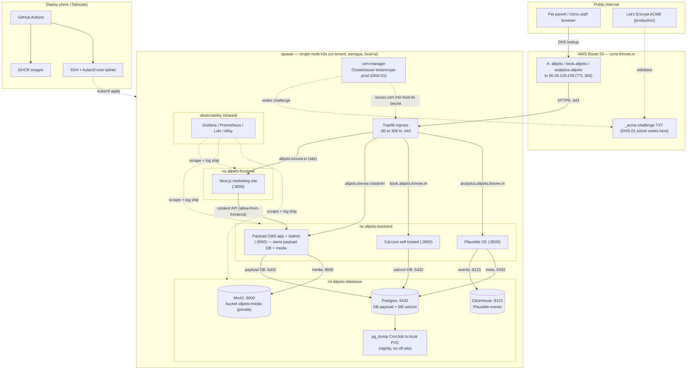

# allpets — System Architecture (HLD)

> **File owner:** 19.1 (supersedes 17.1 — one `architecture.md` owner). · **Area:** `area:docs` · **Repo:** `allpets-backend`.
>
> **Status:** Baseline — 2026-06-15. Authored **after Epics 2–4 shipped** so Epics 5–13 build against a written design. This is the **conceptual spine**; the component-level detail lives in the two LLDs ([19.2 Backend LLD](./lld-backend.md), [19.3 Frontend LLD](../../allpets-frontend/planning/lld-frontend.md)).
>
> **Source of truth:** this doc describes the **decided + already-deployed** reality of Rev 1–5 and Epics 2–4 — never early assumptions. Where this doc and an older spec disagree, the **2026-06-15 owner decisions + cluster verification (including the live manifests in `deploy/k8s/`) win**. The detailed runbooks and ADRs it summarizes:
> - Deploy/ops runbook → [`planning/deployment.md`](./deployment.md)
> - Data-tier decision (plain Postgres, no off-site) → [`planning/database-decision.md`](./database-decision.md) (ADR 4.1)
> - Admin-surface decision (app-auth-only) → [`planning/admin-surface-decision.md`](./admin-surface-decision.md) (ADR 3.6)
> - Ingress pattern (Route 53 + Traefik + cert-manager DNS-01) → [`deploy/k8s/ingress/README.md`](../deploy/k8s/ingress/README.md) (3.4)
> - Requirements → [`planning/requirements.md`](../../planning/requirements.md)
>
> **What is NOT used (recorded so a reviewer grepping these terms finds only explicit disclaimers):** **Cloudflare** is not used (no Cloudflare proxy, no Tunnel, no Cloudflare Access — hosts are plain A-records → quasar WAN). **HTTP-01** is not used (cert solver is **DNS-01** via Route 53; the Epic-3 spec's HTTP-01/port-80 assumption is **superseded**). **CloudNativePG / CNPG** is not used (Postgres is a plain `Deployment` — ADR 4.1). **sealed-secrets / SOPS / external-secrets** are not used in phase 1 (GitHub repo secrets → k8s Secrets at deploy; sealing is **phase-2** hardening). **GitOps** (Flux/Argo + a manifests repo) is not used (CD is **push-based** over Tailscale; GitOps is a phase-2 candidate). A **dedicated clinic server** is not phase-1 (deploy target is the existing `quasar`; the dedicated box is the deferred **phase-2 migration**, Epic 1).

---

## 1. Overview

allpets is the phase-1 website + self-serve appointment scheduler for **All Pets Veterinary Hospital** (single-location clinic, Norman OK). Phase 1 delivers four user-facing capabilities and the infrastructure to run them self-hosted:

1. A **Next.js marketing site** (Home, Services, About, Contact, legal) — credibility + discoverability.
2. **Self-serve booking** delegated to a self-hosted **Cal.com** instance (no Enterprise Edition), embedded into the site.
3. A **Payload CMS** so non-technical clinic staff edit marketing content without a developer or a deploy.
4. **Privacy-respecting analytics** via self-hosted **Plausible Community Edition**.

Everything runs as containers on an **existing single-node k3s cluster on `quasar`**, co-tenant with other production workloads (notably **aarogya**, a healthcare prod stack, and **local-ai**). The architecture is deliberately **container-friendly and vendor-neutral**: no managed cloud database, no cloud load balancer, no cloud-only primitive on the request path. The only external clouds in play are **AWS Route 53** (DNS + the ACME DNS-01 solver), **Let's Encrypt** (certificate authority), and **GitHub / GHCR** (CI + image registry) — none of which sit on the live request path.

The system is built around three load-bearing structural ideas, each detailed below:

- **A two-database boundary** — Payload and Cal.com each own a separate logical database on one Postgres server and **never share rows** (req §7).
- **A three-namespace topology** with **default-deny ingress** NetworkPolicies and explicit allows — frontend, backend, and database tiers are isolated and only the expected paths are open. **The deployed policy permits only `allpets-backend` to reach the data tier; `allpets-frontend` has no data-tier access** (§5).
- **Two orthogonal planes** — a **public-ingress plane** (Traefik on :80/:443, reached over the internet) and a **deploy plane** (GitHub Actions → GHCR → `kubectl` over Tailscale). Neither replaces the other; they share the box but not the path.

### Where the Payload server runs (resolved fact, reconciled to the deployed substrate)

The **Payload server process runs in `allpets-backend`** — alongside Cal.com and Plausible — and it is **Payload (in `allpets-backend`)** that connects to the `payload` database and to MinIO. This matches the deployed substrate exactly:

- `deploy/k8s/networkpolicies/backend-database.yaml` opens the data tier **only** to `allpets-backend` (`allow-from-backend`: namespaceSelector `allpets-backend` → Postgres 5432 / MinIO 9000 / ClickHouse 8123). There is **no `allow-from-frontend` policy on `allpets-database`**, and the frontend repo's only NetworkPolicy (`allpets-frontend/deploy/k8s/networkpolicy.yaml`) makes **no reference to `allpets-database`**.
- The same file's `allow-from-frontend` (on `allpets-backend`) is exactly "Next.js (`allpets-frontend`) → Payload / Cal.com / Plausible app" — i.e. the **Next.js site calls the Payload app**, which lives in the backend.
- `deployment.md` §1.4 lists "Payload" under `allpets-backend`, and its restore/rotation runbook drives Payload as `kubectl -n allpets-backend … deploy/payload`.

**The `allpets.kinvee.in/admin` "same origin" is an HTTP-host fact, not a process-location fact.** Payload `/admin` is served on the **same origin** as the Next.js marketing site (host `allpets.kinvee.in`), but the Payload process itself runs in `allpets-backend`. The frontend never touches the data tier: the Next.js site reaches Payload's content API over the deployed `allow-from-frontend` path (frontend → backend), and **only Payload (backend) reaches Postgres/MinIO** — the one and only data path the deployed policy permits. A `allpets-frontend → allpets-database` allow is therefore **neither deployed nor needed**.

### Hosts (all live, all A-records → `50.35.125.239`)

| Host | Serves | Ingress namespace | Process namespace |
|---|---|---|---|
| `allpets.kinvee.in` | Next.js marketing site **and** Payload `/admin` on the **same origin** | `allpets-frontend` (Ingress for the site) | site → `allpets-frontend`; Payload app → `allpets-backend` |
| `book.allpets.kinvee.in` | Cal.com self-hosted (booking + Cal.com admin) | `allpets-backend` | `allpets-backend` |
| `analytics.allpets.kinvee.in` | Plausible CE dashboard + tracking endpoint | `allpets-backend` | `allpets-backend` |

Cal.com keeps its **own dedicated host** (never a path under `allpets`) because it needs a stable host for cookies and Google OAuth callbacks (req §9).

---

## 2. Component + topology diagram

> Solid arrows are the **live request/data path**; dashed arrows are **control-plane / out-of-band** (cert issuance, observability scrape, deploy). **Note the data-tier paths:** Postgres/MinIO/ClickHouse are reached **only from `allpets-backend`** (Payload, Cal.com, Plausible) — this is the only ingress the deployed `allow-from-backend` policy permits. The Next.js site (in `allpets-frontend`) never touches the data tier directly; it reaches **Payload** (backend) over the `allow-from-frontend` path, and Payload owns all `payload`-DB + MinIO access. The deploy plane (Tailscale) and the public-ingress plane (Traefik :80/:443) are deliberately separate — see §7.

---

## 3. Components

| Component | Role | Host / endpoint | Namespace | Notes |
|---|---|---|---|---|
| **Next.js marketing site** | Public site (Home, Services, About, Contact, legal). App Router, SSR/SSG, Cal.com embed on `/book` and service CTAs. | `allpets.kinvee.in` :3000 | `allpets-frontend` | Reads content from the Payload **content API** (over the `allow-from-frontend` path); **does not** touch Postgres/MinIO directly. Media is proxied through Payload. |
| **Payload CMS 3.x** | Marketing content authoring + the content API. Built on Next.js. The **server process runs in `allpets-backend`**; its `/admin` is served on the **same origin** as the site (`allpets.kinvee.in/admin`). | `allpets.kinvee.in/admin` :3000 | `allpets-backend` | Owns the `payload` DB + MinIO `allpets-media`, and is the **only** allpets workload that connects to them. App-auth-only (3.6). |
| **Cal.com self-hosted** | Booking flow, vet schedules, intake forms, Google Calendar sync, confirmation/reminder email, cancel/reschedule. **No EE** (Cal.diy / Cal.com main without Enterprise). | `book.allpets.kinvee.in` :3000 | `allpets-backend` | Owns the `calcom` DB. Dedicated host for cookies/OAuth. |
| **Plausible CE** | Cookieless, no-PII site analytics + dashboard + tracking script. | `analytics.allpets.kinvee.in` :8000 | `allpets-backend` | Uses its own Postgres metadata (in the shared server) **and** ClickHouse for events. |
| **Postgres 16.x** | One server hosting **two isolated logical databases**: `payload` and `calcom` (+ Plausible metadata). Plain `Deployment` + PVC + `Service` (not CNPG). | `postgres.allpets-database.svc.cluster.local:5432` | `allpets-database` | Roles `payload_app` / `calcom_app`; cross-DB `CONNECT` revoked. **Ingress allowed only from `allpets-backend`** (§5). See §4. |
| **MinIO** | S3-compatible object store for Payload media uploads (vet photos, service heroes). Standalone `StatefulSet`. | `http://minio.allpets-database.svc.cluster.local:9000` | `allpets-database` | Bucket `allpets-media` is **private** (Payload proxies media); Payload uses a **scoped** key, not root; `forcePathStyle: true`. Console :9001 is **not** publicly exposed. Reached only by Payload (from `allpets-backend`). |
| **ClickHouse** | Plausible's event/analytics store (columnar). | :8123 (in-cluster) | `allpets-database` | Backup is the **11.6** seam (port 8123), out of Epic-4 scope. Reached only from `allpets-backend` (Plausible). |
| **pg_dump CronJob** | Nightly logical backup of `payload` + `calcom` to a **local PVC** (14-day retention). Runs **inside** `allpets-database`. | n/a (`pgdump-pvc`) | `allpets-database` | **No off-site** copy — Backblaze dropped (ADR 4.1). RPO ≈ 24h, no PITR. Reaches Postgres via the intra-namespace allow (§5). |
| **Traefik** (k3s default) | Cluster ingress; TLS termination; HTTP→HTTPS 308 redirect. | :80 / :443 (WAN `50.35.125.239`) | `kube-system` (shared) | `IngressClass traefik`; `allowCrossNamespace` OFF (redirect Middleware is per-namespace). |
| **cert-manager** | Issues + auto-renews Let's Encrypt certs via the `letsencrypt-prod` ClusterIssuer, **DNS-01 solver**. | n/a | `cert-manager` (shared) | Writes `_acme-challenge` TXT into the Route 53 `kinvee.in` zone. |
| **Shared observability** | Grafana + Prometheus + Loki + Alloy (+ kube-state-metrics, node-exporter). **Reused**, not re-deployed. | n/a | `observability` (shared) | allpets logs auto-ship; metrics via kube-state-metrics + a scrape addition. See §10. |

---

## 4. The two-database boundary (Payload vs Cal.com)

Phase 1 has **two application databases that never share rows** (req §7). They live on the **same Postgres server** in `allpets-database`, separated by database name and role, with cross-database access revoked. **Both app databases are reached only from `allpets-backend`** — Payload and Cal.com both run there, and the deployed `allow-from-backend` policy is the only ingress into the data tier:

| Database | Owner role | Owns | Reached by |
|---|---|---|---|
| `payload` | `payload_app` | Marketing content (Site Settings, Services, Team/Vets, Promotions, Pages) **and** `contact_submission` (Contact-form inbox) + the Google-reviews cache (10.4). | The **Payload app (ns `allpets-backend`)** — the only client of this DB. The Next.js site (ns `allpets-frontend`) reads this content **via Payload's API**, never by querying Postgres. |
| `calcom` | `calcom_app` | Bookings, vet schedules + date overrides, event types, intake answers, Google-Calendar OAuth tokens, reminder workflows. | The **Cal.com app (ns `allpets-backend`)**. |

**Isolation is enforced, not just conventional (4.3):** each role has `LOGIN` and full DDL on **its own** database only; `CONNECT` on the *other* database is **revoked**; `CONNECT … FROM PUBLIC` is revoked on both. A `psql` connection as `payload_app` into `calcom` **must be denied** (`FATAL: permission denied for database "calcom"`) — this is verified after every restore.

**They link only by reference, never by shared storage.** Payload's `service.calcom_event_type_slug` and `vet.calcom_username` are *pointers* to Cal.com objects so the marketing site can deep-link into the correct booking page; no booking data is replicated into the `payload` database. The frontend never queries Cal.com's tables — it embeds Cal.com's widget. Staff use **two admin UIs** (Payload for content, Cal.com for bookings) — a deliberate phase-1 simplification; a unified dashboard is a phase-2 candidate.

Why one server, two databases: a single Postgres `Deployment` is the smallest operational surface on a shared single-node box (ADR 4.1), while role-level isolation gives each app a private blast radius. Plausible additionally keeps its own metadata in this server and its event data in ClickHouse — separate from both app databases.

---

## 5. Three-namespace topology + deployed NetworkPolicies

Workloads are split across **three** allpets namespaces (plus a reserved `allpets-observability`), all labeled `app.kubernetes.io/part-of: allpets`:

| Namespace | Workloads |
|---|---|
| `allpets-frontend` | Next.js marketing site (the only allpets workload here) |
| `allpets-backend` | **Payload (app + `/admin`)**, Cal.com, Plausible |
| `allpets-database` | Postgres, MinIO, ClickHouse, nightly `pg_dump` CronJob |
| `allpets-observability` | reserved/empty — observability is **reused** from the shared `observability` namespace (§10) |

> **Payload runs in `allpets-backend`, not `allpets-frontend`** (reconciled to the deployed manifests — see §1). The site's `/admin` *origin* is `allpets.kinvee.in`, but the *process* is a backend workload; that is why all `payload`-DB + MinIO access originates from `allpets-backend` and is permitted by `allow-from-backend`.

### Enforced NetworkPolicy posture

Enforcement is **real** — k3s ships the embedded kube-router NetworkPolicy controller, and it is enabled and verified (a frontend pod is refused DB:5432; a backend pod succeeds; DNS works). The posture is **default-deny *ingress* per namespace + explicit allows**; **egress is left open** so SMTP, Google APIs, GHCR, and DNS continue to work.

Deployed allows (these are the exact policies in `allpets-backend/deploy/k8s/networkpolicies/` and `allpets-frontend/deploy/k8s/networkpolicy.yaml`):

| Flow | Ports | Source → Destination | Policy / Notes |
|---|---|---|---|
| Public traffic in (site) | 3000 | Traefik (`kube-system`) → `allpets-frontend` | `allow-traefik-ingress` (frontend). Next.js site. |
| Public traffic in (backend) | 3000 / 8000 | Traefik (`kube-system`) → `allpets-backend` | `allow-traefik-ingress` (backend). Cal.com :3000, Plausible :8000 (+ Payload `/admin` :3000). The committed ingress port contract. |
| **Frontend → backend** | (namespace-scoped; all ports until app ports settle) | `allpets-frontend` → `allpets-backend` | `allow-from-frontend`. Next.js site → **Payload / Cal.com / Plausible app** (SSR + content API + POST). This is how the site reads Payload content — **not** a data-tier path. |
| **Backend → data tier** | 5432 / 9000 / 8123 | `allpets-backend` → `allpets-database` | `allow-from-backend`. Postgres / MinIO / ClickHouse. **The only ingress into `allpets-database`. There is no `allpets-frontend → allpets-database` allow — and none is needed, because the DB clients (Payload, Cal.com, Plausible) all run in `allpets-backend`.** |
| Observability scrape | scrape | `observability` → each allpets namespace | `allow-observability-scrape` (present in every allpets ns). Metrics + log discovery. |
| **Intra-namespace → Postgres** (Epic 4) | 5432 | any pod in `allpets-database` → Postgres | **NET-NEW** (`allow-intra-namespace-postgres.yaml`). |
| **Intra-namespace → MinIO** (Epic 4) | 9000 | any pod in `allpets-database` → MinIO | **NET-NEW** (`allow-intra-namespace-minio.yaml`). |

> **Why there is no frontend→database allow.** The Next.js site never opens a Postgres/MinIO connection: it reads marketing content through **Payload's content API** (a backend HTTP call, covered by `allow-from-frontend`), and Payload — running in `allpets-backend` — is the sole client of the `payload` DB and MinIO (covered by `allow-from-backend`). Keeping the data tier reachable **only** from `allpets-backend` is the deployed, verified posture; opening it to the frontend would widen the blast radius for no functional gain.
>
> **Why the two intra-namespace allows exist.** NetworkPolicy does **not** exempt same-namespace traffic once `default-deny-ingress` (podSelector `{}`) selects a pod. Epic 4's in-namespace `postgres-init` / `minio-setup` Jobs and the nightly `pgdump` CronJob connect to `postgres:5432` / `minio:9000` **inside** `allpets-database` — without these two allows they hang on connect and fail silently (timeout, not error). This is the one place the runbook knowingly deviates from the earlier 2.6 "no new NetworkPolicy needed" note, which only covered the cross-namespace backend→database flow. Both policies are wired into `deploy/k8s/kustomization.yaml` and apply before the workloads.

**Port-contract rule:** the ingress port map (Cal.com 3000, Plausible 8000) is pinned to `networkpolicies/backend-database.yaml` (`allow-traefik-ingress`). Change a backend port → update that NetworkPolicy in the **same commit**, or Traefik→pod traffic is dropped.

---

## 6. DNS & TLS

### DNS — AWS Route 53 (`kinvee.in`)

`kinvee.in` is a **user-owned AWS Route 53 public hosted zone** (`Z03680532RXMMGHR1HB0Y`), authoritative (registrar NS delegation matches the AWS set). The three allpets hosts are **live A-records** (not CNAME), TTL 300, all → **`50.35.125.239`** (quasar's WAN, effectively static — the home/office router statically forwards :80/:443 to Traefik):

| Host | Type | Target | TTL |
|---|---|---|---|
| `allpets.kinvee.in` | A | `50.35.125.239` | 300 |
| `book.allpets.kinvee.in` | A | `50.35.125.239` | 300 |
| `analytics.allpets.kinvee.in` | A | `50.35.125.239` | 300 |

**No Cloudflare** — no proxy, no Tunnel, no Access. The A-records point straight at the WAN IP; if that IP ever changes, the A-records are the single point to update (cert issuance is unaffected — see below).

### TLS — cert-manager + Traefik, `letsencrypt-prod`, **DNS-01**

TLS reuses quasar's existing **cert-manager `letsencrypt-prod` ClusterIssuer** — ACME **production** (`acme-v02.api.letsencrypt.org`), proven by 6+ live certs (e.g. `ai.kinvee.in`). The solver is **DNS-01 via Route 53** (hosted zone `Z03680532RXMMGHR1HB0Y`, region `ap-south-1`, creds in the k8s secret `route53-credentials`) — **not HTTP-01**.

**The Epic-3 spec's HTTP-01/port-80-for-issuance assumption is superseded.** Because cert-manager already controls the `kinvee.in` zone, it solves challenges by writing `_acme-challenge` **TXT** records — so:
- The three host certs issue with **zero** extra issuer / RBAC / secret config — just the Ingress annotation + a `tls` block.
- **Port-80 reachability is not required for issuance** (works even behind CGNAT); :80/:443 are only needed to *serve* traffic.
- There is **no `/.well-known/acme-challenge` HTTP path** anywhere, so the HTTP→HTTPS redirect is safe — it cannot break ACME.

**Ingress pattern (canonical — `deploy/k8s/ingress/`):** `apiVersion: networking.k8s.io/v1`, `kind: Ingress`; `spec.ingressClassName: traefik`; annotation `cert-manager.io/cluster-issuer: letsencrypt-prod`; `spec.tls: [{ hosts: [<host>], secretName: <host>-tls }]`; a single `host` rule, `path: /`, `pathType: Prefix` → the backend Service. An Ingress lives in the **same namespace as its Service**, so there is one Ingress per host. Each host also references a **per-namespace `redirect-https` Traefik Middleware** (`redirectScheme: https`, `permanent: true`, a **308**). The redirect is per-namespace (not a cluster-wide Traefik arg) because Traefik's `allowCrossNamespace` is OFF and a cluster-wide redirect would change behavior for every co-tenant including aarogya (healthcare prod). Renewal is automatic (~30 days before the 90-day expiry); expiry alerting is handed to 16.8.

---

## 7. Deploy plane vs public-ingress plane

Two planes coexist on quasar; **they share the box but not the path**, and neither replaces the other.

| | **Public-ingress plane** | **Deploy plane** |
|---|---|---|
| Purpose | Serve user traffic | Ship code + apply manifests |
| Transport | Public internet → router :80/:443 → **Traefik** | **Tailscale** tailnet (CI runner joins as `tag:ci`) |
| Path | Route 53 A-record → WAN `50.35.125.239` → Traefik → per-host Ingress → Service | GitHub Actions → GHCR → SSH to quasar over the tailnet → `kubectl` |
| Reaches | the three public hosts | the cluster API (`quasar.tailb77b7f.ts.net` / `100.108.60.90`) |
| Auth boundary | app login (3.6 — no ingress auth middleware) | tailnet membership + SSH |

**Why this matters architecturally:** admin surfaces are deliberately **not** routed through the deploy plane (no tailnet-only admin Ingress) — clinic staff must reach Payload `/admin` from arbitrary, un-managed devices, so the admin surface stays on the public-ingress plane and is gated by app login only (3.6). Keeping the planes orthogonal means the tailnet can evolve (15.11/15.12) without touching public admin access, and the public ingress can change without touching CI. Tailnet-only is reserved for future **operator-only** surfaces (e.g. the MinIO console :9001, internal debug endpoints), not clinic-facing or public ones.

---

## 8. Secrets

Phase-1 secrets posture: **GitHub repository secrets** (encrypted at rest by GitHub, masked in Actions logs) are **materialized into Kubernetes `Secret`s at deploy time** by the CD workflow (`kubectl create secret … --dry-run=client | kubectl apply`). No ciphertext is committed to git; no env files are baked into images.

- The repos carry **`*.example.yaml` templates only** (placeholder `REPLACE_ME`), excluded from kustomize `resources`. Apps consume **stable Secret names/keys** (e.g. `postgres-secret`, `minio-root-secret`, `minio-payload-key`) so the materialization source can change without renaming.
- **Today**, the 14.6 GitHub-secrets→k8s-Secret pipeline does **not exist yet**, so the operator creates the real Secrets **out-of-band** with generated strong values (`openssl rand`), keeping names/keys stable. **14.6 will own** materialization + rotation.
- **`sealed-secrets` / SOPS / external-secrets-operator are NOT used in phase 1** — they are **phase-2 hardening** so secrets never transit CI in plaintext. Recorded as an explicit deferral, not an oversight.
- **Do-not-rotate landmine:** Cal.com's `CALENDSO_ENCRYPTION_KEY` encrypts credential rows in the `calcom` DB. Changing it makes existing encrypted rows undecryptable (connected calendars break). It must stay **identical** across any redeploy/restore and is **excluded** from any "rotate all DB secrets" sweep (owned by Epic 6, flagged in the data-tier runbook).

---

## 9. CI/CD

**GitHub Actions → GHCR → push-based deploy over Tailscale** — mirroring the proven `local-ai-proxy` pattern on this box. **Not GitOps** (no Flux/Argo, no in-cluster reconcile agent, no separate manifests repo as the source of truth — those are phase-2 candidates).

Flow: a push builds container images in GitHub Actions → pushes them to **GHCR** → the CI runner **joins the tailnet** (`tag:ci`) → **SSHes to `quasar`** → runs **`kubectl apply -k deploy/k8s`** (per repo) against the cluster (whose API is also on the tailnet). Images are **version-pinned, digest preferred** (14.8) — never `latest`, never a bare major. Rollback + the full CI/CD runbook are Epic 15 (15.8).

**Reproducibility:** all manifests apply via `kubectl apply -k deploy/k8s` (a single kustomize tree per repo); frontend manifests live in **allpets-frontend**, backend/shared in **allpets-backend**. A clean "rebuild from repo on a fresh box" (substrate capture: the issuer + k3s install, observability portability, a BOOTSTRAP/DR runbook) is **deferred to the Epic-15 hardening pass**.

---

## 10. Observability

allpets **reuses quasar's existing shared observability stack** — Grafana + Prometheus + Loki + **Alloy** (+ kube-state-metrics, node-exporter, metrics-server) — rather than standing up a dedicated one. `allpets-observability` is reserved/empty.

- **Logs — zero change:** Alloy discovers all pods (no namespace filter), so allpets logs auto-ship to the shared Loki. Query `{namespace=~"allpets.*"}`.
- **Metrics:** allpets pods are covered by kube-state-metrics + metrics-server (`kubectl top -n allpets-*`). The shared Prometheus is `static_configs` with no cAdvisor, so per-pod *usage* series need a small scrape addition (`deploy/k8s/observability/prometheus-allpets-scrape.yaml`, owner sign-off — shared infra). App `/metrics` is added per app epic.
- **Deferred:** Uptime Kuma (2.8 — use a free external monitor pre-launch) and GlitchTip (2.10 — revisit when apps exist). No-PII-in-logs is the app epics' responsibility (5.9 / 8.10 / Cal.com).

---

## 11. Co-tenancy + the 2.12 resource budget

allpets is a **co-tenant** on a single ~31 GiB / 16-vCPU node that also runs **aarogya** (healthcare prod), `local-ai`, `home-assistant`, and others. Anything cluster-wide is shared blast-radius for those tenants — which is exactly why this design avoids cluster-wide operators (no CNPG), avoids cluster-wide Traefik redirect args, and reuses (not re-deploys) the shared observability stack.

The **blast-radius guard (2.12)** is a per-namespace `LimitRange` (default req 100m/256Mi, limit 250m/512Mi) **+** a `ResourceQuota`:

| Namespace | Requests | Limits |
|---|---|---|
| `allpets-database` | 2 cpu / 8Gi | 6 cpu / 12Gi |
| `allpets-backend` | 1.5 cpu / 4Gi | 5 cpu / 8Gi |
| `allpets-frontend` | 0.5 cpu / 1Gi | 2 cpu / 2Gi |
| `allpets-observability` | 0.5 cpu / 0.5Gi | 1 cpu / 1Gi |

Total allpets **requests ≈ 4 vCPU / 13.5 GiB of 16 / 31** — wide headroom for the co-tenants, and a spike in one allpets pod cannot OOM-kill a neighbor (incl. healthcare prod). App epics set each pod's values **within** these caps. **Relief-lever order** if RAM pressure hits: (1) move Plausible to Plausible Cloud (drops the heaviest in-cluster trio), (2) trim observability retention, (3) the Epic-1 phase-2 hardware migration. Storage is **`local-path` only** (node-pinned, non-expandable; no ZFS) — sized with headroom up front.

---

## 12. Architecture Decisions

Each decision is recorded once in its ADR; this log links them so the spine stays current to what is live. **Where a decision overrides an older spec, the decision wins.**

### 12.1 Plain Postgres `Deployment`, **not CloudNativePG** — ADR [`database-decision.md`](./database-decision.md) (4.1)
Postgres runs as a plain Kubernetes `Deployment` + `local-path` PVC + `ClusterIP` Service, **not** the CNPG operator. Rationale: solo non-expert operator; parity with the proven aarogya shape on this exact box; CNPG would add a cluster-wide operator + CRDs + webhook to a node that also runs healthcare prod, and its headline features (failover, PITR) don't pay off on a single node with no durable archive target. **CNPG is not used** (re-evaluate at the phase-2 multi-node migration). Accepted trade-off: no HA/failover, no automated PITR.

### 12.2 Local-only backup, **no off-site** (Backblaze dropped) — ADR [`database-decision.md`](./database-decision.md) (4.1)
The nightly `pg_dump` CronJob → a **local PVC** is the **primary and only** backup (14-day retention). The original Backblaze B2 off-site copy (4.4 / 1.9) is **DROPPED**. Owner-accepted trade-off: same-box durability (a disk/host loss loses both the live data and its backups), **RPO ≈ 24h, no PITR** — in exchange for zero external dependency/credential/cost. Recorded so "why is there no off-site backup?" resolves to *this decision*, not an oversight. (Plausible ClickHouse backup is the separate 11.6 seam, port 8123.)

### 12.3 Admin surface **app-auth-only** — ADR [`admin-surface-decision.md`](./admin-surface-decision.md) (3.6)
Both sensitive surfaces — Payload `/admin` (on `allpets.kinvee.in`) and the Cal.com admin (on `book.allpets.kinvee.in`) — are protected by **application login only**: plain Ingress at `/`, **no** Traefik auth middleware (no basic-auth, no forward-auth), **no** tailnet-only Ingress, **no Cloudflare Access**. Rationale: mirrors the in-prod `admin.ai.kinvee.in` precedent on this box; non-technical clinic staff must reach `/admin` from arbitrary devices (tailnet-only rejected); a middleware would be the first in the cluster (`allowCrossNamespace` is off). Brute-force defense is delegated to the app layer — rate-limiting (14.2) + session-cookie hygiene / no public signup (5.11 Payload, 6.x Cal.com).

### 12.4 **DNS-01** over HTTP-01 — ADR [`deploy/k8s/ingress/README.md`](../deploy/k8s/ingress/README.md) (Epic 3, supersedes the Epic-3 spec)
The `letsencrypt-prod` ClusterIssuer solves ACME challenges via the **DNS-01 Route 53 solver**, **not HTTP-01**. The Epic-3 spec's HTTP-01 / port-80-for-issuance assumption is **superseded** by the 2026-06-15 cluster verification. Consequences: certs issue with zero extra config (cert-manager already controls `kinvee.in`); issuance doesn't need port-80 reachability; there is no ACME HTTP path, so the 308 HTTP→HTTPS redirect is safe.

### 12.5 Cal.com self-hosted, **no Enterprise Edition** — decision_calcom
Booking is delegated to self-hosted Cal.com (Cal.diy MIT fork preferred; fall back to Cal.com main without enabling EE) rather than a custom scheduler. Free, self-hosted, no recurring license fee. Accepted trade-offs from staying off EE: **no "any available vet"** round-robin (specific-vet selection only), **no pet-parent-configurable reminders** (admin-configured workflows instead), no multi-pet single booking, and **two admin UIs** (Payload + Cal.com). All are recorded phase-2 candidates (req §11). Cal.com keeps its **own dedicated host** for cookies/OAuth.

### 12.6 Deploy plane / public-ingress plane split — §7; deployment runbook + Rev 3
CI/CD is **push-based over Tailscale** (GHCR + SSH + `kubectl`), kept orthogonal to the public-ingress plane (Traefik :80/:443). **Not GitOps** (Flux/Argo deferred to phase 2). The two planes share the box but not the path; admin surfaces ride the public plane (app-auth-only), never the tailnet. Secrets are GitHub repo secrets materialized at deploy (14.6 will own it); **sealed-secrets is phase-2** (§8).

### 12.7 Data tier reachable **only from `allpets-backend`** — §5; `networkpolicies/backend-database.yaml`
The deployed `allow-from-backend` policy is the **sole** ingress into `allpets-database` (Postgres 5432 / MinIO 9000 / ClickHouse 8123). All DB/object-store clients — **Payload, Cal.com, Plausible** — run in `allpets-backend`, so **no `allpets-frontend → allpets-database` allow exists or is needed**. The Next.js site reaches Payload's content API over `allow-from-frontend` (frontend → backend), and Payload (backend) is the only client of the `payload` DB + MinIO. This keeps the data tier's blast radius to one namespace and matches the verified cluster behavior (frontend pod refused on :5432, backend pod succeeds).

---

## 13. Scope guardrails (explicit non-uses)

Recorded so a reviewer grepping these terms finds only disclaimers — none of the following is part of phase 1:

- **Cloudflare** — not used (no proxy / Tunnel / Access). Hosts are plain Route 53 A-records → quasar WAN.
- **HTTP-01** — not used / **superseded**. Cert solver is **DNS-01** via Route 53.
- **CloudNativePG (CNPG)** — not used. Postgres is a plain `Deployment` (12.1). Re-evaluated phase-2.
- **sealed-secrets / SOPS / external-secrets** — not used in phase 1. Phase-2 hardening (§8).
- **GitOps (Flux / Argo)** — not used. CD is push-based over Tailscale (12.6). Phase-2 candidate.
- **Dedicated clinic server** — not phase-1. Deploy target is the existing `quasar`; the dedicated box is the deferred phase-2 migration (Epic 1).
- **Off-site backup (Backblaze B2)** — dropped (12.2). Local-only nightly `pg_dump`.
- **`allpets-frontend → allpets-database` NetworkPolicy** — not deployed and not needed; the data tier is reached only from `allpets-backend` (12.7).

---

## 14. References

- Requirements: [`planning/requirements.md`](../../planning/requirements.md) — §1–§4 (product), §5 (admin), §7 (data boundary), §8 (NFRs), §9 (infra constraints), §11 (phase-2), §12 (deliverables).
- Deploy/ops runbook: [`planning/deployment.md`](./deployment.md) — cluster base (Epic 2), DNS/TLS/ingress (Epic 3), data-tier ops (Epic 4), CI/CD (Epic 15).
- ADR 4.1 (plain Postgres, no off-site): [`planning/database-decision.md`](./database-decision.md).
- ADR 3.6 (admin app-auth-only): [`planning/admin-surface-decision.md`](./admin-surface-decision.md).
- Ingress pattern (Route 53 + Traefik + cert-manager DNS-01): [`deploy/k8s/ingress/README.md`](../deploy/k8s/ingress/README.md).
- Deployed NetworkPolicies: [`deploy/k8s/networkpolicies/backend-database.yaml`](../deploy/k8s/networkpolicies/backend-database.yaml) (+ `allow-intra-namespace-postgres.yaml`, `allow-intra-namespace-minio.yaml`); frontend side: [`allpets-frontend/deploy/k8s/networkpolicy.yaml`](../../allpets-frontend/deploy/k8s/networkpolicy.yaml).
- Epic 19 issue specs: [`planning/issues/epic-19-design-baseline.md`](../../planning/issues/epic-19-design-baseline.md).
- LLDs that cite this spine: [`planning/lld-backend.md`](./lld-backend.md) (19.2), [`allpets-frontend/planning/lld-frontend.md`](../../allpets-frontend/planning/lld-frontend.md) (19.3).
