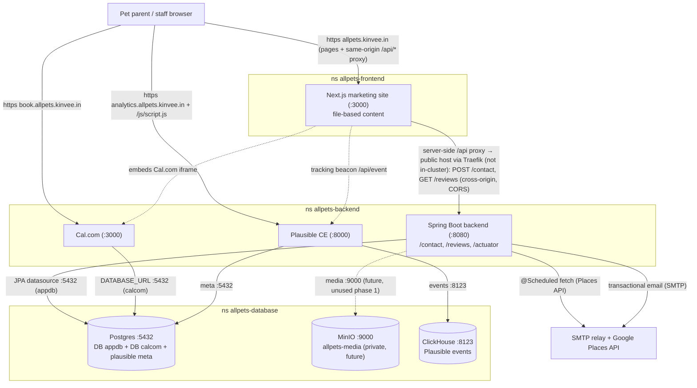

# allpets — Backend LLD (19.2)

> **File owner:** 19.2. · **Area:** `area:docs` · **Repo:** `allpets-backend`.
>
> **Status:** **Revised 2026-06-17 for the Spring-backend pivot (supersedes the Payload-centric baseline).** The component-level design the backend epics build to: the custom **Spring Boot backend** (contact-form, Google-reviews cache, transactional email, actuator), **Cal.com** (Epic 6), the **Google-reviews cache** (Epic 10), **Plausible** (Epic 11), and the **email + security** seams (Epics 13/14). It is the implementation-ready companion to the [System HLD](./architecture.md) (19.1) and the [Frontend LLD](../../allpets-frontend/planning/lld-frontend.md) (19.3).
>
> **Spine, not a copy.** This LLD **cites** the HLD; it does not re-derive topology, DNS/TLS, the NetworkPolicy posture, the deploy plane, the resource budget, or the ADRs. Where the HLD or an ADR already decided something, this doc references it by **topic name** (the HLD section numbers just changed in the pivot — cite the topic, not the number) and details only the *backend-app* design. Authoritative sources, in order of precedence:
> - System HLD → [`planning/architecture.md`](./architecture.md) (19.1) — the *Overview / Spring-backend location*, *two-database boundary*, *three-namespace topology + NetworkPolicies*, *DNS & TLS*, *deploy-plane split*, *secrets*, *observability*, *co-tenancy budget*, *phase-2 direction*, and *Architecture Decisions* topics.
> - Data-tier ADR (plain Postgres, no off-site) → [`planning/database-decision.md`](./database-decision.md) (ADR 4.1)
> - Admin-surface ADR (app-auth-only) → [`planning/admin-surface-decision.md`](./admin-surface-decision.md) (ADR 3.6)
> - Ingress pattern (Route 53 + Traefik + cert-manager **DNS-01**) → [`deploy/k8s/ingress/README.md`](../deploy/k8s/ingress/README.md) (3.4)
> - Epic specs → [`epic-06-calcom-selfhosted.md`](../../planning/issues/epic-06-calcom-selfhosted.md), [`epic-10-google-reviews.md`](../../planning/issues/epic-10-google-reviews.md), [`epic-13-email-transactional.md`](../../planning/issues/epic-13-email-transactional.md), [`epic-14-security-hardening.md`](../../planning/issues/epic-14-security-hardening.md)
>
> **The pivot in one line (2026-06-17):** **Payload CMS is gone.** Marketing content is now **file-based** in the Next.js repo (typed / MDX in `allpets-frontend`) — not a backend concern. The custom backend is a **Spring Boot service** in `allpets-backend`, on its own host `api.allpets.kinvee.in`, reached by the site's **server-side `/api` proxy** (cross-origin; the browser stays same-origin — Frontend LLD §4.2); it owns the **`appdb`** database (role **`app_svc`**, renamed from the old `payload`) and is the **seed of the phase-2 application** (pet profiles + multi-tenancy — §12).
>
> **Inherited non-uses (HLD *Scope guardrails* topic, restated so a grepping reviewer finds only disclaimers):** **no Payload / headless CMS** (marketing content is file-based in `allpets-frontend`); no Cloudflare; **DNS-01 not HTTP-01**; **plain Postgres `Deployment`, not CloudNativePG**; no sealed-secrets/SOPS/external-secrets in phase 1; no GitOps (push-based CD); **no off-site backup** (local-only `pg_dump`); no NodePort (data tier is `ClusterIP` only); admin/auth surfaces **app-auth-only** (no Traefik auth middleware); **pet profiles / multi-tenancy are not built in phase 1** (seeded only — §12). This LLD must never contradict those.

---

## 1. Scope & the backend processes

This LLD designs the **app processes that live in `allpets-backend`** plus their data-tier contracts in `allpets-database`. Per the HLD *Spring-backend location* and *three-namespace topology* topics, **all three DB/object-store clients run in `allpets-backend`**, and the deployed `allow-from-backend` NetworkPolicy is the **only** ingress into the data tier — the Next.js site (`allpets-frontend`) never touches Postgres/MinIO/ClickHouse, and it never makes an in-cluster call to the backend either: it ships **file-based content** and reaches the **Spring API** over the public host `api.allpets.kinvee.in` via a **same-origin route-handler proxy** whose server-side fetch is cross-origin (the browser stays same-origin).

| Process | Owns | Host(s) | Data tier it touches | Epic |
|---|---|---|---|---|
| **Spring Boot backend** (Gradle/Kotlin-DSL, **Java 25 LTS**, **Spring Boot 3.x**, Spring Data JPA + Hibernate, Flyway, Actuator) — code **we write** | `ContactSubmission` (contact-form inbox), the Google-reviews cache (10.4), transactional email (Epic 13), health/metrics (Actuator). **Seed of phase-2** (§12). | `api.allpets.kinvee.in` :8080 (its **own** origin) | `appdb` DB (5432) + MinIO `allpets-media` (9000, **future** — reserved, unused in phase 1) | new (this pivot) / 10 / 13 |
| **Cal.com self-hosted** (no EE) — a **product we deploy**, not code we write | Bookings, vet schedules, event types, intake answers, Google-Calendar OAuth tokens, reminder workflows | `book.allpets.kinvee.in` :3000 | `calcom` DB (5432) | 6 |
| **Plausible CE** — a **product we deploy** | Cookieless site analytics + dashboard + tracking script | `analytics.allpets.kinvee.in` :8000 | Plausible meta in Postgres (5432) + ClickHouse events (8123) | 11 |

> **Spring backend vs Cal.com/Plausible.** Only the Spring backend is **code this team authors**; Cal.com and Plausible are upstream products configured by env + manifests (largely unchanged from the prior baseline — §7/§8). The Spring service replaces the former Payload Node process entirely: there is **no CMS, no content database, no admin UI, no Lexical, no S3-media adapter for content**. The HLD *Spring-backend location* topic resolves the location: the Spring **process** runs in `allpets-backend`, reached by the site's **server-side `/api` proxy** over its **own public host** (cross-origin; the browser itself stays same-origin), and it is the workload from which all `appdb` (+ future MinIO) access originates.

---

## 2. Request / data flow



> Solid arrows are the live request/data path; dashed arrows are out-of-band, embedded, or **reserved-but-unused** (MinIO). The site→API path is **public and cross-origin** (the site's server-side `/api` proxy calls `api.allpets.kinvee.in` through Traefik; the browser stays same-origin), gated by the Spring CORS allowlist — there is **no** in-cluster frontend→backend call (the former Payload `allow-from-frontend` content-API seam is removed by the pivot). The only ingress into `allpets-database` is from `allpets-backend` (HLD *NetworkPolicies* + *data-tier-only-from-backend* decision topics).

---

## 3. Spring Boot backend — build, runtime & module structure

### 3.1 Build & runtime stack

| Concern | Choice | Notes |
|---|---|---|
| Build tool | **Gradle (Kotlin DSL)** — `build.gradle.kts`, wrapper pinned | Reproducible builds; wrapper committed so CI uses the exact Gradle version. |
| Language / JDK | **Java 25 LTS** | `toolchain { languageVersion = JavaLanguageVersion.of(25) }` so the build is JDK-pinned independent of the runner. |
| Framework | **Spring Boot 3.x** (latest stable at build time) | Web (`spring-boot-starter-web`), Validation, Data JPA, Mail, Actuator, Flyway. |
| Persistence | **Spring Data JPA + Hibernate** | Entities + repositories; schema is owned by **Flyway**, never `ddl-auto` against prod (set `spring.jpa.hibernate.ddl-auto=validate`). |
| Migrations | **Flyway** | Versioned SQL under `src/main/resources/db/migration/` (§5). Runs on app startup; `validate` mode confirms the live schema matches. |
| Image | **multi-stage Docker** (`deploy/Dockerfile.api`) **or Jib** → **GHCR** | Non-root runner, base pinned by digest (14.8). Either is acceptable; pick one in the image issue and document. |
| Health/metrics | **Actuator + Micrometer** | `/actuator/health` (liveness + readiness groups), `/actuator/prometheus` scraped by the shared Prometheus (HLD *observability* topic). |

### 3.2 Package / module structure (clean layering)

A single deployable module, layered by responsibility, organized **domain-first** so phase-2 bounded contexts slot in (§12):

```
com.allpets.api
├── config            # CORS allowlist, security, JPA, mail, scheduling, Actuator wiring
├── contact           # web · service · domain · repository for the contact form
│   ├── web           #   ContactController  (POST /contact)
│   ├── service       #   ContactService     (validate → persist → trigger email)
│   ├── domain        #   ContactSubmission   (JPA @Entity)
│   └── repository    #   ContactSubmissionRepository (Spring Data JPA)
├── reviews           # web · service · domain · repository for the Google-reviews cache
│   ├── web           #   ReviewsController   (GET /reviews — cached only)
│   ├── service       #   ReviewsService (@Scheduled fetch + atomic cache swap)
│   ├── domain        #   ReviewCache        (JPA @Entity)
│   └── repository    #   ReviewCacheRepository
├── email             # EmailService (Spring Mail), templates, From-address policy (Epic 13)
└── common
    ├── tenant        # TenantAware base entity / tenant_id convention — PHASE-2 SEED ONLY (§12)
    └── web           # error model, RestControllerAdvice, rate-limit/honeypot hooks (owned by 14.x)
```

- **Clean layering rule:** `web → service → repository → domain`. Controllers do no persistence; services own transactions (`@Transactional`); repositories are Spring Data interfaces over the JPA entities. Cross-domain calls go service-to-service, never controller-to-repository.
- **Tenant-aware convention (phase-2 seed, NOT built now):** `common.tenant` defines the *convention* a future `@MappedSuperclass TenantAware` base entity (carrying a `tenant_id` column) would follow. **Phase 1 is effectively single-tenant** — no `tenant_id` column is created, no tenant filter is applied, no `Tenant` entity exists yet. New tables use **stable surrogate keys** and avoid hard-coding "one clinic" so a later tenant dimension is cheap to add. Which strategy (shared-schema `tenant_id` vs schema-per-tenant vs db-per-tenant) is **deliberately undecided** and resolved in the phase-2 HLD (§12; HLD *phase-2 direction* topic).

### 3.3 Phase-1 endpoints / domain

| Method · Path | Purpose | Auth | Owner |
|---|---|---|---|
| `POST /contact` | Bean-validate the payload, persist a `ContactSubmission`, then trigger a staff-notification email (§4 + §6). Honeypot + per-IP rate-limit applied here (hooks owned by **14.2/14.3**). | Public (unauthenticated), rate-limited | this LLD + 14.x + 13.x |
| `GET /reviews` | Serve the **cached** Google reviews + aggregate rating + `fetchedAt` — **never** a live Google call on the request path (Epic 10, 10.6/10.7). Typed-empty 200 on cold cache, never 5xx. | Public, read-only | Epic 10 |
| `GET /actuator/health` | Liveness + readiness (DB-backed readiness group). Unauthenticated, fast, no PII. The k8s probe target (§8) and the rollout health-gate. | Public (operator-lockable later, ADR 3.6) | this LLD |
| `GET /actuator/prometheus` | Micrometer metrics for the shared Prometheus scrape. | scrape-only (cluster) | HLD *observability* topic |

> The **Google-reviews refresh** is a Spring `@Scheduled` task inside `ReviewsService` (24-hour cadence, req §6.2 / Epic 10) — **not** a separate k3s CronJob and **not** the former Node fetch script. It calls the Google **Places API** (shared GCP project + billing with Cal.com's OAuth, Epic 6 6.8 / Epic 10 10.2), normalizes ≤5 reviews + the aggregate, and **atomically swaps** the cache row (§5). A failed fetch leaves the prior batch intact (10.7); the read path (`GET /reviews`) is decoupled from Google entirely.

---

## 4. Spring backend ↔ Postgres (`appdb`)

- **Database:** **`appdb`**, owner role **`app_svc`** (ADR 4.1 / 4.3). **This is the former `payload` DB/role, renamed by the pivot** — `appdb` replaces `payload`, and `app_svc` replaces `payload_app`. The role has `LOGIN` + full DDL on `appdb` only; `CONNECT` on `calcom` is **revoked**, and `CONNECT … FROM PUBLIC` is revoked on both — a `psql` as `app_svc` into `calcom` must be denied (HLD *two-database boundary* topic, verified post-restore). The `calcom` DB/role is **unchanged**.
- **Endpoint (in-cluster):** `postgres.allpets-database.svc.cluster.local:5432` (`ClusterIP`, reached over `allow-from-backend`).
- **Datasource (Spring):** `spring.datasource.url=jdbc:postgresql://postgres.allpets-database.svc.cluster.local:5432/appdb`, with `spring.datasource.username`/`password` injected from the k8s Secret (§9) — **never** in `application.yml`. HikariCP pool sized small (single-replica clinic volume). `spring.jpa.hibernate.ddl-auto=validate`.
- **Migrations:** **Flyway** (`spring.flyway.enabled=true`), versioned SQL under `db/migration/` (§5). Flyway runs on startup and brings an empty `appdb` fully up; re-running on a current DB is a no-op (idempotent). Because the app owns its own schema via Flyway, there is **no** separate migration Job for the Spring service (contrast Cal.com's Prisma `migrate deploy` Job, §7) — though a CI drift check (validate against a throwaway Postgres) is recommended, mirroring the prior baseline's intent.
- **Pre-created extensions (ADR 4.1 / 4.3):** `pgcrypto`, `uuid-ossp`, `citext`, `pg_trgm` are created at DB init so the app never needs `CREATE EXTENSION` privilege at migrate time; the `app_svc` role must **not** assume superuser.
- **Readiness gate:** the Actuator **readiness** group includes a DB check (Spring Boot's `db` health indicator over the datasource) → readiness flips `UP` only when `appdb` is reachable. This is the k8s readiness probe target (§8).

### 4.1 Data model

The phase-1 `appdb` schema is two tables. Both follow the tenant-aware convention (stable surrogate PK, no single-clinic assumption) without yet carrying a `tenant_id` column (§3.2 / §12).

**`contact_submissions`** — public-write inbox; persisted by `POST /contact`.

| Column | Type | Notes |
|---|---|---|
| `id` | `uuid` PK (default `gen_random_uuid()`) | surrogate key (pgcrypto) |
| `name` | `text` NOT NULL | bean-validated (`@NotBlank`, length-bounded) |
| `email` | `citext` NOT NULL | `@Email`; `citext` for case-insensitive lookups (erasure 14.10) |
| `message` | `text` NOT NULL | `@NotBlank`, length-bounded |
| `created_at` | `timestamptz` NOT NULL default `now()` | indexed `DESC` for newest-first triage |
| `source_ip` | `inet` NULL | spam triage only; **no PII in logs** (§10, req §8.4) |
| `user_agent` | `text` NULL | spam triage only |

> Mapped by the `ContactSubmission` JPA `@Entity` (domain) + `ContactSubmissionRepository`. Retention/purge of rows older than the agreed window (default 180d) is **14.10** — a `@Scheduled` purge or k3s CronJob deleting by `created_at`, logging counts only. Erasure-by-email (14.10) keys off `email` (`citext`).

**`reviews_cache`** — single current batch of Google reviews; written by the `@Scheduled` refresh, read by `GET /reviews`.

| Column | Type | Notes |
|---|---|---|
| `id` | `smallint` PK, fixed `= 1` (single-row "latest") | one current batch only — overwrite, no history (Google caching ToS, Epic 10) |
| `aggregate_rating` | `numeric(2,1)` NULL | clinic's overall rating |
| `rating_count` | `integer` NULL | total review count |
| `reviews` | `jsonb` NOT NULL default `'[]'` | array of normalized `{author, rating, text, relativeTime, publishedAt, profilePhotoUrl}`; clamped to **≤5** (Places API cap, Epic 10 modeling note) |
| `fetched_at` | `timestamptz` NULL | drives staleness display + stale-cache alerting (10.7) |

> **Atomic swap:** the refresh writes the new batch in one transaction (upsert the single `id=1` row) so `GET /reviews` never reads a half-written set; a failed/empty fetch leaves the prior row untouched (10.7). Modeled as a plain table + JPA entity (`ReviewCache`) — **not** a Payload collection (Payload is gone); the read path is the Spring `GET /reviews` endpoint, not a generic content API.

### 4.2 Flyway migrations

| Version | File | Creates |
|---|---|---|
| **V1** | `V1__init.sql` | `contact_submissions` + `reviews_cache` (above), plus their indexes (`contact_submissions(created_at DESC)`). Assumes the ADR-4.1 pre-created extensions exist (`gen_random_uuid()` from `pgcrypto`, `citext`). |

Future domain (pet profiles, etc.) adds `V2__…` onward; the convention is **forward-only, committed, idempotent** SQL — never edited after merge.

---

## 5. Spring backend ↔ MinIO (reserved, **unused in phase 1**)

- **Store:** MinIO standalone `StatefulSet`, bucket **`allpets-media`**, **private** (ADR 4.1 / 4.6–4.8). Endpoint (in-cluster) `http://minio.allpets-database.svc.cluster.local:9000`, reached over `allow-from-backend`; console `:9001` is **not** publicly exposed.
- **Status in phase 1: wired and available, but the Spring backend does not use it.** Marketing media is **file-based** (it ships inside the Next.js site image; the former Payload-proxied media path and `next/image remotePatterns` for a Payload origin are **gone**). The contact form and reviews cache store nothing in object storage.
- **Reserved for phase 2 — pet-profile photos/documents (§12).** When that arrives, the Spring backend will use the MinIO **scoped** key (policy `s3:GetObject/PutObject/DeleteObject` on `arn:aws:s3:::allpets-media/*` + `s3:ListBucket`), materialized from a `minio-app-key` Secret (§9) — **never** `MINIO_ROOT_*` — with the AWS S3 SDK configured `forcePathStyle`/path-style for MinIO. Keeping the bucket + scoped key provisioned now (HLD *components* topic) means phase 2 is wiring, not new infra.
- **NetworkPolicy note:** the `allow-from-backend` policy already permits backend→MinIO :9000, so no policy change is needed when phase 2 begins to use it; in phase 1 the path simply sees no traffic.

---

## 6. Transactional email (Epic 13)

The Spring backend is the **site-mail** sender: the contact-form staff notification (and any future app mail). Cal.com remains the **booking-mail** sender. Both point at the **same** transactional SMTP relay and the **same** verified sending domain so DMARC alignment is uniform (Epic 13 — two senders, one provider, one domain).

- **Transport: Spring Mail (`spring-boot-starter-mail` / `JavaMailSender`) over SMTP** — the Spring analogue of the former Payload nodemailer transport. Provider chosen in 13.1 (default **Brevo** SMTP unless the client's Workspace preference, 18.15, overrides); creds from the k8s Secret (§9), never in code. STARTTLS on 587 (or TLS on 465).
- **Config:** `spring.mail.host`/`port`/`username`/`password` from env (Secret), plus app properties for `EMAIL_FROM` (on the verified domain so 13.3's DKIM signs it) and `EMAIL_FROM_NAME`. `secure=(port==465)`, STARTTLS otherwise.
- **Templated:** `EmailService` renders a templated staff-notification message (e.g. a small template engine or text template) carrying the submission `name`/`email`/`message` — `From:` = verified sender, `To:` = the clinic inbox (from app config). The contact-create flow calls `EmailService` **after** the row is persisted (so a transient SMTP failure does not lose the submission; send failures are logged, not surfaced as a 5xx to the visitor).
- **Verification seam (13.6):** a config-correctness send — triggering the contact-notification path delivers to the clinic inbox with the right `From:`/`To:`/subject and a `DKIM-Signature` header present (proves 13.3 signing applies to Spring mail). The full front-end E2E is 16.4; the deliverability gate (≥9/10, SPF+DKIM+DMARC aligned, inbox-not-spam) across **both** senders is 13.9.
- **SPF/DKIM/DMARC** live in Route 53 (Epic 13 13.3) — DNS work, not backend code; one correct record set covers both senders because they share the `From:` domain. **Bounce/complaint webhook handling (13.8, P2)** would land as a small unauthenticated `POST` endpoint in the Spring backend (signature-verified, exempt from CSRF/rate-limit by path) if/when built — not in the phase-1 critical path.

---

## 7. Cal.com (Epic 6)

Self-hosted **without EE** (Cal.diy MIT fork preferred; Cal.com `main` with EE disabled as fallback — pinned tag/SHA recorded in 6.1). Next.js + tRPC + **Prisma**/Postgres monorepo (`apps/web`). Configured almost entirely by env. **Unchanged by the pivot** — Cal.com is a deployed product, independent of the Spring backend.

- **Host:** `book.allpets.kinvee.in` — its **own dedicated origin** (never a path under `allpets`) because Cal.com needs a stable host for **cookies + Google OAuth callbacks** (HLD *Overview / hosts* topic, req §9). The Spring API now gets its own host for the same reasons (§8 / HLD *DNS & TLS* topic).
- **Database:** `calcom`, owner role **`calcom_app`** (ADR 4.1 / 4.3) — scoped grants, **separate from `app_svc`**. `DATABASE_URL` (runtime secret) → `postgres://calcom_app:<pw>@postgres.allpets-database.svc.cluster.local:5432/calcom`.
- **Migrations (6.5):** ship **upstream's committed migrations** and apply with **`prisma migrate deploy`** only — never `prisma db push`/`migrate dev` against prod. The migrate **Job** runs from the same `:sha` image and is `kubectl wait --for=condition=complete`'d **before** the rollout (15.9 gate). Set **`lock_timeout`** on the migrate connection so a blocking `ALTER` on the single-replica instance fails fast instead of hanging live bookings. Idempotent.

### 7.1 Env matrix (6.4) — build-time vs runtime, secret vs plain

| Var | Class | Value / note |
|---|---|---|
| `NEXT_PUBLIC_WEBAPP_URL` | build-time, plain (repo **variable**) | `https://book.allpets.kinvee.in` — **inlined by Next at build**, cannot be overridden at runtime (6.2). Build-arg in 15.5. |
| `NEXTAUTH_URL` | runtime, plain | `https://book.allpets.kinvee.in` |
| `NEXTAUTH_SECRET` | runtime, **secret** (≥32 chars) | session signing |
| **`CALENDSO_ENCRYPTION_KEY`** | runtime, **secret** (**exactly 32 chars**) | encrypts stored OAuth/credential rows in the `calcom` DB. ⚠️ **GENERATE ONCE, NEVER ROTATE.** Changing it makes every encrypted credential row (vet Google-Calendar connections) **undecryptable**; it must stay identical across any redeploy/restore and is **excluded** from any "rotate all DB secrets" sweep (HLD *secrets* topic, req §9, Epic 6 6.4 / Epic 14 14.6). |
| `DATABASE_URL` | runtime, **secret** | the `calcom` DB user (4.3), **not** the Spring `app_svc` user |
| `EMAIL_FROM`, `EMAIL_SERVER_HOST/PORT/USER/PASSWORD` | runtime, **secret** | SMTP (6.6 / 13.4); **same relay + aligned sending domain** as the Spring backend's mail (§6, 13.9) |
| `GOOGLE_API_CREDENTIALS` | runtime, **secret** | OAuth client JSON (6.8/6.9), one-line; redirect URI `https://book.allpets.kinvee.in/api/integrations/googlecalendar/callback`. **Shared GCP project + billing** with the reviews Places API (Epic 10 10.2). |
| EE-disable flags (per 6.1) | build/runtime, plain | no EE license key set |

> **Build-arg vs runtime split (6.2/6.4):** only `NEXT_PUBLIC_*` are baked at build (repo *variables* → build-args, 15.5). Every server-only secret stays runtime via the k8s Secret (14.6). Build uses harmless placeholders for server-only vars; **never** run `prisma migrate` at build.

### 7.2 Behavior boundaries (no-EE)

Specific-vet selection only (each vet is a Cal.com **user**). One **event type per (vet, service)** carrying the standard **10-field intake** (6.11); the event-type **slug** is the booking deep-link key the Next.js site (file-based content) points at via its `calcomEventTypeSlug` / `calcomUsername` pointers (these now live in the frontend's content files, not a CMS — resolution/dead-link validation is 6.16). Reminders are **admin-configured email workflows** (6.12, email-only — no SMS phase 1); cancellation cutoff per event type (6.13). **No** "any available vet" round-robin, **no** pet-parent-configurable reminders, **no** managed event types — all EE, all out of scope (HLD ADR *Cal.com no-EE* topic). Probes target Cal.com's built-in health path. Single replica (raise only with budget headroom + sticky-session review). The embed's CSP `frame-ancestors` that lets the Epic-9 iframe load this host is tuned in 14.11.

---

## 8. Per-app k8s wiring

Each backend app folds in the same shape: a `Deployment` + `Service`, the 3.4 ingress template (Ingress + per-namespace `redirect-https` Middleware), env via `secretKeyRef`, probes, and resource requests/limits within the co-tenancy budget (HLD *co-tenancy* topic). **No `:latest`** in committed YAML — the immutable `:sha` is set at deploy (15.9).

| App | Deployment / container | Service | Ingress host → TLS secret | Probe target | Replicas |
|---|---|---|---|---|---|
| **Spring backend** | `allpets-api` / `api`, port **8080**, RollingUpdate `maxUnavailable:0/maxSurge:1` | `allpets-api` :80 → 8080 | **`api.allpets.kinvee.in`** → **`api-allpets-kinvee-in-tls`** (Ingress in **this repo**, `allpets-backend` ns) | liveness `/actuator/health/liveness`; readiness `/actuator/health/readiness` (DB-backed) | 1 (raise w/ headroom) |
| Cal.com (6.3) | `calcom` / `calcom`, port 3000 | `calcom` :80 → 3000 | `book.allpets.kinvee.in` → `book-allpets-kinvee-in-tls` (this repo) | Cal.com built-in health path, generous `initialDelaySeconds` | 1 |
| Plausible (11.1) | `plausible` / `plausible`, port 8000 | `plausible` :80 → 8000 | `analytics.allpets.kinvee.in` → `analytics-allpets-kinvee-in-tls` (this repo) | Plausible built-in | 1 |

- **The new API host (pivot).** `api.allpets.kinvee.in` is a **net-new** public host: a Route 53 A-record → `50.35.125.239` (TTL 300), its **own Traefik Ingress + cert-manager DNS-01 cert** `api-allpets-kinvee-in-tls` in `allpets-backend`, fronting the Spring `Service` on **:8080**. The site's server-side `/api` proxy calls it **cross-origin** (the browser stays same-origin — Frontend LLD §4.2; HLD *DNS & TLS* + *Spring-backend location* topics). This replaces the former `allpets.kinvee.in/admin` routing of Payload — the Spring API is **not** served as a path under the site (the site's `/api/*` proxy is a Next.js route handler, not a Traefik ingress path to the backend).
- **CORS (Spring side, not ingress).** Cross-origin access is controlled by the **Spring app's CORS config** (`config` package), **not** a Traefik middleware. The allowlist is exactly **`https://allpets.kinvee.in`** (the site origin; plus localhost for dev) — **never `*`** in production — with the methods/headers `POST /contact` + `GET /reviews` need and credentials **off** in phase 1. Keeping the origin boundary in the app avoids adding the cluster's first cross-namespace Traefik middleware (HLD *DNS & TLS* topic, Epic 10 10.6).
- **Ingress rules (3.4, non-negotiable):** `ingressClassName: traefik`; annotation `cert-manager.io/cluster-issuer: letsencrypt-prod`; `spec.tls.secretName = <host>-tls`; single `host` rule, `path: /`, `pathType: Prefix`; the per-namespace `redirect-https` Middleware annotation (`<namespace>-redirect-https@kubernetescrd`, a **308**, per-namespace because `allowCrossNamespace` is OFF). The Ingress lives in the **same namespace as its Service** — `api`, `book`, and `analytics` are all in this repo's `allpets-backend` namespace and **share one** `allpets-backend` `redirect-https` Middleware. The site's own Ingress (`allpets.kinvee.in`) is in the **frontend** repo.
- **Netpol port contract (HLD *NetworkPolicies* topic):** Traefik → backend on **8080** (Spring API), **3000** (Cal.com), **8000** (Plausible); backend → data tier on **5432** (Postgres) / **9000** (MinIO, future) / **8123** (ClickHouse). These ports are pinned to `networkpolicies/backend-database.yaml` (`allow-traefik-ingress` + `allow-from-backend`) — **change a backend port → update that NetworkPolicy in the same commit**, or Traefik→pod / app→data traffic is dropped. Egress is open so the Spring backend reaches **SMTP** + the **Google Places API**, and Cal.com reaches Google OAuth. There is **no** `allpets-frontend → allpets-database` allow (none needed) and **no** `allow-from-frontend` backend seam anymore (the site's `/api` proxy reaches the API over the public host, not in-cluster).
- **TLS:** certs issue via cert-manager `letsencrypt-prod` **DNS-01** (Route 53), zero extra issuer/RBAC/secret config — including the new `api-allpets-kinvee-in-tls`; port-80 reachability is **not** required for issuance; the 308 redirect cannot break ACME (no HTTP challenge path) (HLD *DNS & TLS* + ADR *DNS-01* topics).
- **JVM footprint (pivot sizing note).** The Spring backend is a **JVM** workload with a heavier idle memory baseline than the removed Node/Payload process — it must be sized **carefully within the `allpets-backend` quota** (req ≈1.5 cpu / 4Gi, limit 5 cpu / 8Gi; HLD *co-tenancy* topic). Set an explicit **`-XX:MaxRAMPercentage`** (or `-Xmx`) so the JVM heap stays **inside** the pod's memory limit — a JVM that ignores cgroup limits is a classic OOM-kill cause and a blast-radius risk to the healthcare-prod co-tenant. **JVM + Cal.com are the two heavy tenants** in `allpets-backend` (Plausible/ClickHouse are the other memory draw, in the database ns) — they are the ones to watch under RAM pressure; right-size requests so both fit under the namespace cap.

---

## 9. Secrets contract (HLD *secrets* topic; ADR 4.1)

Phase-1 posture: GitHub **repo secrets** → materialized into k8s `Secret`s at deploy by the CD workflow (`kubectl create secret … --dry-run=client | kubectl apply`). Repos carry **`*.example.yaml` templates only** (placeholder `REPLACE_ME`), excluded from kustomize `resources`. Apps consume **stable Secret names/keys** so the materialization source can change without renaming. **No** sealed-secrets/SOPS/external-secrets in phase 1 (phase-2 hardening). 14.6 owns materialization + rotation; until then the operator creates real Secrets out-of-band with `openssl rand` values.

| Secret name | Keys | Consumed by | Notes |
|---|---|---|---|
| `postgres-secret` (bootstrap) | `POSTGRES_USER`, `POSTGRES_PASSWORD`, `POSTGRES_DB`, `APP_SVC_PASSWORD`, `CALCOM_APP_PASSWORD` | Postgres workload (4.2) + role init (4.3) | role passwords feed the Spring datasource + Cal.com `DATABASE_URL`. **`APP_SVC_PASSWORD` is the renamed former `PAYLOAD_APP_PASSWORD`.** |
| `minio-root-secret` | `MINIO_ROOT_USER`, `MINIO_ROOT_PASSWORD` | MinIO `StatefulSet` (4.6) | root — **never** used by the Spring backend |
| `minio-app-key` | scoped access key + secret | Spring backend — **future (phase 2)** | the **scoped** `allpets-media` user (4.7); provisioned now, unused in phase 1 (§5) |
| `allpets-backend-secret` (Spring app env) | `SPRING_DATASOURCE_USERNAME`, `SPRING_DATASOURCE_PASSWORD` (for `appdb`), `SPRING_MAIL_*` / `EMAIL_FROM` (SMTP, §6), `GOOGLE_PLACES_API_KEY` (reviews), and `GOOGLE_PLACE_ID` (plain config, may be ConfigMap) | Spring backend via `secretKeyRef` | DB creds, email creds, Google API key — **never in code or image**. `GOOGLE_PLACE_ID` is public, not secret. |
| `calcom-secret` (Cal.com env) | `DATABASE_URL` (`calcom`), `NEXTAUTH_SECRET`, **`CALENDSO_ENCRYPTION_KEY`**, `GOOGLE_API_CREDENTIALS`, `EMAIL_SERVER_*` | Cal.com (6.3) via `secretKeyRef` | kept **separate** from the Spring Secret so a Cal.com redeploy doesn't churn the API's Secret. Non-secret `NEXT_PUBLIC_*`/`NEXTAUTH_URL` as plain env / ConfigMap. |

> **Do-not-rotate landmine (HLD *secrets* topic, req §9, Epic 14 14.6, restated):** `CALENDSO_ENCRYPTION_KEY` must be **excluded** from any rotation sweep and materialized **write-once** — re-pushing a changed value corrupts every encrypted vet-calendar credential row. The 14.6 materialization/rotation flow must respect this (owned by Epic 6). It is unrelated to the Spring backend's secrets but shares the deploy-time materialization mechanism.

---

## 10. Conventions

- **Image pinning (14.8):** all images **version-pinned, digest preferred** — never `latest`. The Spring backend image is built in CI (Gradle → multi-stage Docker **or Jib**) → GHCR → deployed by the immutable `:sha` tag (no `:latest` in YAML, 15.9). `FROM` lines pinned by digest; Trivy scans the built image (HIGH/CRITICAL, `--ignore-unfixed`) per 14.8. Data-tier images per ADR 4.1: `postgres:16.x`, pinned MinIO + `mc`.
- **Dockerfile / runtime:** multi-stage (or Jib's layered output), **non-root** runner (the JVM process runs as a non-root user, 14.x). Build-time placeholder env only; real values at runtime via Secret. `GIT_SHA`/`BUILD_TIME` surfaced via Actuator `info` for traceability. Set `-XX:MaxRAMPercentage` so the heap respects the container limit (§8).
- **Security inputs (14.x):** **bean-validation** on every public input (`@Valid` + `@NotBlank`/`@Email`/length bounds on the contact DTO); the **CORS allowlist** (§8, exactly `https://allpets.kinvee.in`, no `*`); **per-IP rate-limit + honeypot** on `POST /contact` (14.2/14.3 — the `common.web` hooks reject filled-honeypot submissions server-side with a benign 200, and return `429 + Retry-After` over the threshold; client IP read from `X-Forwarded-For` behind Traefik); secrets from env/Secret only (§9). No CSRF needed for the unauthenticated, CORS-gated cross-origin POST beyond Origin/Referer validation (14.4); when an authed admin surface arrives it is **app-auth-only** (ADR 3.6 — no Traefik auth middleware, no tailnet-only Ingress).
- **Resource budget (HLD *co-tenancy* topic):** the Spring pod sets requests/limits within `allpets-backend` (req 1.5 cpu / 4Gi, limit 5 cpu / 8Gi, shared with Cal.com/Plausible). JVM + Cal.com are the memory-hungry pair — size against remaining headroom; an unbounded pod is a shared-blast-radius risk to healthcare-prod co-tenants.
- **Health / readiness:** Actuator liveness + DB-backed readiness groups (§4 / §8) — the rollout health-gate (15.9). Flyway migrates on startup; the readiness gate holds traffic until the schema validates and the DB is reachable.
- **Observability (HLD *observability* topic):** logs auto-ship to the shared Loki (`{namespace=~"allpets.*"}`); Micrometer `/actuator/prometheus` is added to the shared Prometheus scrape; **no PII in logs** (contact `source_ip`/`user_agent`, reviewer text, Cal.com intake). The `@Scheduled` reviews refresh logs counts + aggregate + latency, **never** the Places API key or reviewer PII beyond what is already public; a stale `fetched_at` is alertable (10.7).

---

## 11. Cross-references the backend epics build to

- **Spring backend ↔ 4.x** — `appdb` DB / `app_svc` role (renamed from `payload`/`payload_app`) / pre-created extensions (§4); Flyway `V1__init.sql` (§4.2); MinIO scoped key reserved-but-unused (§5).
- **6.x ↔ 4.3** — `calcom` DB / `calcom_app` role; `CALENDSO_ENCRYPTION_KEY` never-rotate (§7/§9).
- **10.x ↔ §3.3/§4.1** — `@Scheduled` Places-API fetch → atomic `reviews_cache` swap → `GET /reviews` cached-only read + fallback (10.4/10.6/10.7); shared GCP project with 6.8.
- **13.x ↔ §6** — Spring Mail over the shared SMTP relay + verified domain; config-check (13.6) vs deliverability gate (13.9); two senders (Spring + Cal.com), one provider, one domain.
- **14.x ↔ §8/§10** — CORS allowlist, bean-validation, rate-limit/honeypot on `POST /contact`, secrets materialization (14.6), image pin/scan (14.8), erasure + `contact_submissions` retention (14.10), non-root JVM.
- **11.x ↔ §7 (table)** — Plausible hosts/ports; ClickHouse → 11.6 backup seam (unchanged).
- **api/calcom/plausible ↔ 3.4 + 14.6 + 15.x** — ingress template (incl. the **new `api.allpets.kinvee.in`** Ingress + DNS-01 cert), secrets materialization, CI/CD `:sha` pinning + Cal.com migrate-gate.
- **§12 ↔ phase-2** — clean domain packages + tenant-aware conventions so pet profiles + multi-tenancy extend this service.

---

## 12. Phase-2 seed — pet/patient profiles + multi-branch multi-tenancy (design-level only)

The Spring backend is built as the **seed of the phase-2 application**, not a throwaway phase-1 glue layer (HLD *phase-2 direction* + *build-the-Spring-backend-as-the-phase-2-seed* decision topics). **None of phase 2 is built now**; this subsection only records how it slots in, so phase-1 choices don't block it. Phase-2 design gets its **own HLD/LLD**.

- **Pet / patient profiles (the deferred Pet Portal).** New bounded contexts as **new domain packages** (e.g. `profiles`, `records`) under `com.allpets.api`, each with its own web · service · domain · repository layering (§3.2) and Flyway migrations (`V2__…` onward) in the same `appdb`. Photos/documents land in **MinIO `allpets-media`** via the scoped key already provisioned and wired (§5/§9) — phase 2 is wiring, not new infra. This is the capability deferred out of phase 1.
- **Authentication & authorization.** Profiles need real auth (Spring Security) and authorization — still **app-auth-only** at the edge (ADR 3.6: no Traefik auth middleware, no tailnet-only Ingress for clinic-facing surfaces). The phase-1 endpoints (`POST /contact`, `GET /reviews`) stay public; the auth surface is additive.
- **Tenant scoping (multi-branch).** The phase-1 **tenant-aware conventions** (§3.2: a `common.tenant` seam, stable surrogate keys, no implicit single-clinic assumption) make adding a tenant dimension cheap. The **tenancy strategy is deliberately undecided** in phase 1 — the three candidates (**shared-schema `tenant_id`** vs **schema-per-tenant** vs **database-per-tenant**) trade off isolation, backup/restore granularity, and operational overhead on this single-node box, and will be resolved in the phase-2 HLD before any tenant data model is committed. Phase 1 must not hard-code single-tenant assumptions that block any of the three (e.g. no `WHERE clinic = 'the one clinic'` baked into queries, no PKs that assume one location).

---

## 13. References

- System HLD (the spine): [`planning/architecture.md`](./architecture.md) (19.1) — cite by **topic name** (numbers changed in the pivot): *Overview / Spring-backend location*, *component table*, *two-database boundary*, *three-namespace topology + NetworkPolicies*, *DNS & TLS (DNS-01)*, *deploy-plane vs public-ingress split*, *secrets (+ CALENDSO caveat)*, *CI/CD*, *observability*, *co-tenancy + JVM footprint*, *phase-2 direction*, *Architecture Decisions (drop Payload → file-based content; new Spring backend; dedicated `api.` host + CORS; phase-2 seed)*, *Scope guardrails*.
- Cal.com epic: [`planning/issues/epic-06-calcom-selfhosted.md`](../../planning/issues/epic-06-calcom-selfhosted.md) — 6.1 fork, 6.2/6.17 image, 6.3 manifests, 6.4 env (CALENDSO), 6.5 Prisma migrate, 6.8/6.9 Google OAuth, 6.11 event-types, 6.16 link validation.
- Google-reviews epic: [`planning/issues/epic-10-google-reviews.md`](../../planning/issues/epic-10-google-reviews.md) — 10.1 Place ID, 10.2 shared GCP project + key, 10.3 fetch/normalize (≤5 cap), 10.4 cache table, 10.6 read endpoint, 10.7 fail-safe fallback.
- Email epic: [`planning/issues/epic-13-email-transactional.md`](../../planning/issues/epic-13-email-transactional.md) — 13.1 provider, 13.2 domain verify, 13.3 SPF/DKIM/DMARC, 13.4 Cal.com SMTP, 13.5 Spring/app mail (the former Payload-nodemailer task), 13.6/13.7 config checks, 13.9 deliverability gate.
- Security epic: [`planning/issues/epic-14-security-hardening.md`](../../planning/issues/epic-14-security-hardening.md) — 14.1 headers, 14.2 rate-limit, 14.3 honeypot, 14.4 CSRF/Origin, 14.5/14.6 secrets, 14.7/14.8 supply chain, 14.10 erasure + retention, 14.11 CSP.
- Data-tier ADR: [`planning/database-decision.md`](./database-decision.md) (ADR 4.1) — plain Postgres, roles/DBs/extensions, MinIO scoped key + private bucket, local-only backup, secret names.
- Admin-surface ADR: [`planning/admin-surface-decision.md`](./admin-surface-decision.md) (ADR 3.6) — app-auth-only.
- Ingress pattern: [`deploy/k8s/ingress/README.md`](../deploy/k8s/ingress/README.md) (3.4) — host→namespace→TLS map (incl. the new `api.allpets.kinvee.in`), DNS-01, per-namespace `redirect-https`, app-auth-only fold-in.
- Frontend LLD (sibling): [`allpets-frontend/planning/lld-frontend.md`](../../allpets-frontend/planning/lld-frontend.md) (19.3) — file-based marketing content; a same-origin `/api` proxy that server-side-fetches the Spring API (cross-origin).
