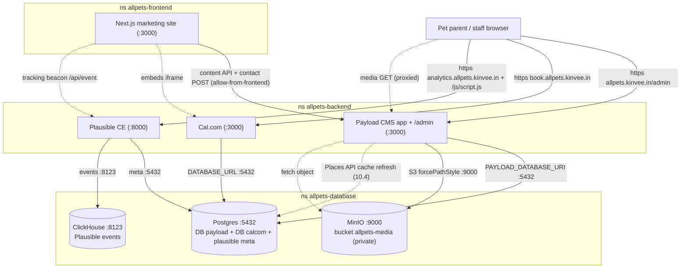

# allpets — Backend LLD (19.2)

> **File owner:** 19.2. · **Area:** `area:docs` · **Repo:** `allpets-backend`.
>
> **Status:** Baseline — 2026-06-17. The component-level design the backend epics build to: **Epic 5** (Payload CMS), **Epic 6** (Cal.com), **Epic 10** (Google-reviews cache), **Epic 11** (Plausible), **Epics 13/14** (email + hardening seams). It is the implementation-ready companion to the [System HLD](./architecture.md) (19.1) and the [Frontend LLD](../../allpets-frontend/planning/lld-frontend.md) (19.3).
>
> **Spine, not a copy.** This LLD **cites** the HLD; it does not re-derive topology, DNS/TLS, the NetworkPolicy posture, the deploy plane, the resource budget, or the ADRs. Where the HLD or an ADR already decided something, this doc references it and details only the *backend-app* design. Authoritative sources, in order of precedence:
> - System HLD → [`planning/architecture.md`](./architecture.md) (19.1)
> - Data-tier ADR (plain Postgres, no off-site) → [`planning/database-decision.md`](./database-decision.md) (ADR 4.1)
> - Admin-surface ADR (app-auth-only) → [`planning/admin-surface-decision.md`](./admin-surface-decision.md) (ADR 3.6)
> - Ingress pattern (Route 53 + Traefik + cert-manager **DNS-01**) → [`deploy/k8s/ingress/README.md`](../deploy/k8s/ingress/README.md) (3.4)
> - Epic specs → [`epic-05-payload-cms.md`](../../planning/issues/epic-05-payload-cms.md), [`epic-06-calcom-selfhosted.md`](../../planning/issues/epic-06-calcom-selfhosted.md)
>
> **Inherited non-uses (HLD §13, restated so a grepping reviewer finds only disclaimers):** no Cloudflare; **DNS-01 not HTTP-01**; **plain Postgres `Deployment`, not CloudNativePG**; no sealed-secrets/SOPS/external-secrets in phase 1; no GitOps (push-based CD); **no off-site backup** (local-only `pg_dump`); no NodePort (data tier is `ClusterIP` only); admin surfaces **app-auth-only** (no Traefik auth middleware). This LLD must never contradict those.

---

## 1. Scope & the backend processes

This LLD designs the three **app processes that live in `allpets-backend`** plus their data-tier contracts in `allpets-database`. Per HLD §1 and §5, **all three DB/object-store clients run in `allpets-backend`**, and the deployed `allow-from-backend` NetworkPolicy is the **only** ingress into the data tier — the Next.js site (`allpets-frontend`) never touches Postgres/MinIO/ClickHouse; it reaches Payload's content API over `allow-from-frontend`.

| Process | Owns | Host(s) | Data tier it touches | Epic |
|---|---|---|---|---|
| **Payload CMS 3.x** (Next.js-native; admin + REST/GraphQL + content API in **one** Next app) | Marketing content + `ContactSubmission` + the reviews cache (10.4) | `allpets.kinvee.in/admin` (same origin as the site) | `payload` DB (5432) + MinIO `allpets-media` (9000) | 5 / 10 |
| **Cal.com self-hosted** (no EE) | Bookings, vet schedules, event types, intake answers, Google-Calendar OAuth tokens, reminder workflows | `book.allpets.kinvee.in` | `calcom` DB (5432) | 6 |
| **Plausible CE** | Cookieless site analytics + dashboard + tracking script | `analytics.allpets.kinvee.in` | Plausible meta in Postgres (5432) + ClickHouse events (8123) | 11 |

> **Process-location vs HTTP-host fact (HLD §1).** `allpets.kinvee.in/admin` being the *same origin* as the marketing site is an HTTP-routing fact; the Payload *process* runs in `allpets-backend`. The frontend repo serves the host Ingress; Payload rides the same host but the pod is a backend workload, which is why all `payload`-DB + MinIO access originates from `allpets-backend`.

---

## 2. Request / data flow



> Solid arrows are the live request/data path; dashed arrows are out-of-band or proxied. Note: media is **never** served from MinIO directly — the bucket is private and Payload proxies every read (§4). The only ingress into `allpets-database` is from `allpets-backend` (HLD §5, ADR 12.7).

---

## 3. Payload CMS — data model

Payload 3.x runs as a single Next.js app (`src/payload.config.ts`, collections in `src/collections/`, globals in `src/globals/`), `@payloadcms/db-postgres` adapter, **Lexical** rich text (5.2), `@payloadcms/storage-s3` for MinIO. Package manager **pnpm**. The model below is the 5.19 sign-off target: every field an Epic-8 page needs exists before the frontend builds against it.

### 3.1 Globals & collections (overview)

| Kind | Name | File | `useAsTitle` | Public `read` | Mutations | Consumed by |
|---|---|---|---|---|---|---|
| Global (singleton) | `SiteSetting` | `src/globals/SiteSetting.ts` | — | yes | `admin` | footer/header/contact (8.6/8.10), schema.org (12.4) |
| Collection | `Service` | `src/collections/Services.ts` | `name` | active only | `admin` | Services pages (8.3/8.7/8.8), booking deep-link (9.3), Cal.com link (6.16) |
| Collection | `Vet` | `src/collections/Vets.ts` | `name` | active only | `admin` | About/Home (8.4/8.9), booking deep-link (9.3) |
| Collection | `TeamMember` | `src/collections/TeamMembers.ts` | `name` | active only | `admin` | About (8.4/8.9) |
| Collection | `Promotion` | `src/collections/Promotions.ts` | `title` | yes (frontend date-filters) | `admin` | Home/Services (8.2/8.7) |
| Collection | `Page` | `src/collections/Pages.ts` | `title` | by slug | `admin` | About/Privacy/Terms (8.9/8.11), SEO (12.1) |
| Collection | `ContactSubmission` | `src/collections/ContactSubmissions.ts` | `email` | **denied** | public `create`; `read` admin; update/delete admin-or-off | contact POST (8.10), notify (13.6), retention (14.10) |
| Collection (upload) | `Media` | `src/collections/Media.ts` | `filename` | yes (proxied) | `admin` | uploads for Service/Vet/TeamMember heroes & photos |
| Collection (auth) | `Users` | `src/collections/Users.ts` | `email` | self/admin | `create` admin-only | admin auth (5.11) |
| Collection (cache) | `GoogleReview` | `src/collections/GoogleReviews.ts` | `authorName` | yes | system/admin | reviews carousel (Epic 10, see §7.3) |

### 3.2 Key fields per collection

**`SiteSetting` (global, 5.3)** — clinic-wide singleton.

| Field | Type | Notes |
|---|---|---|
| `clinicName` | text* | |
| `address` | group | `line1`, `line2`, `city`, `state`, `zip` (structured, not free-text) |
| `phone`, `email` | text | placeholders match Epic-18 TBD-CLIENT (e.g. `(405) 555-0100`) |
| `emergencyReferralText` | textarea | |
| `hours` | array `{day, open, close, closed:checkbox}` | per-day closed state |
| `social` | array `{platform, url}` | |
| `footerText` | richText/textarea | |
| `heroHeadline`, `heroSubcopy` | text | |

**`Service` (5.4)** — backs Services index/detail and the "Book this service" CTA.

| Field | Type | Notes |
|---|---|---|
| `name` | text* | |
| `slug` | text* | **unique, indexed**; `beforeValidate` auto-slugifies from `name` when blank |
| `icon` | text/select | |
| `heroImage` | upload → `Media` | |
| `shortDescription` | textarea* | |
| `longDescription` | richText (Lexical) | |
| `whatsIncluded` | array of text | req §4.2 (Rev-2 add) |
| `typicalDurationMin` | number | feeds Cal.com event-type duration (6.11) |
| `price` | number, optional | |
| `calcomEventTypeSlug` | text | **pointer** to a Cal.com event type; string only here — resolution/validation is 6.16, never a Cal.com query |
| `active` | checkbox, default true | |
| `displayOrder` | number | `defaultColumns: [name, active, displayOrder, calcomEventTypeSlug]` |

**`Vet` (5.5)** — marketing profile + Cal.com pointer + services performed.

| Field | Type | Notes |
|---|---|---|
| `name` | text* | |
| `role` | text | |
| `photo` | upload → `Media` | |
| `bio` | richText/textarea | |
| `credentials` | array of text | |
| `servicesPerformed` | relationship → `Service`, hasMany | |
| `calcomUsername` | text | **pointer** to the vet's Cal.com user; deep-link key for 9.3, validated by 6.16 |
| `active`, `displayOrder` | checkbox / number | |

**`TeamMember` (5.6)** — non-vet staff; identical shape to `Vet` minus the Cal.com/service fields (`name`*, `role`, `photo`, `bio`, `credentials`, `active`, `displayOrder`). Kept a **separate** collection from `Vet` (5.5 decision; duplication noted in 5.19) — no shared base.

**`Promotion` (5.7)** — time-boxed promos. `title`* · `body`(richText) · `code` · `ctaText` · `ctaUrl` · `activeFrom`(date) · `activeTo`(date) · `placement`(select: `Home` | `Services`). `beforeValidate` ensures `activeTo > activeFrom`. Frontend filters the active window from the public `read`.

**`Page` (5.8)** — long-form. `title`* · `slug`*(unique; `about`/`privacy`/`terms`) · `body`(richText) · `seo`(group: `metaTitle`, `metaDescription`, feeds 12.1) · `active`.

**`ContactSubmission` (5.9)** — public-write inbox. `name`* · `email`* · `message`* · `createdAt`(auto) · optional `meta`(ip/userAgent for spam triage — mind §8.4 "no PII in logs"). `admin.defaultSort: '-createdAt'`. Effectively **read-only in admin** (newest first).

**`Media` (5.10, upload)** — `upload: true`; the S3 adapter targets MinIO (see §5). Image-size variants (AVIF/WebP responsive set) are tuned in 7.13, not here.

**`Users` (5.11, auth)** — `auth: true`; a `role` select (default `admin`) for forward-compatibility. One phase-1 role.

### 3.3 Relationships

```
Vet.servicesPerformed ──hasMany──▶ Service
Service.heroImage / Vet.photo / TeamMember.photo ──upload──▶ Media
Service.calcomEventTypeSlug ──string pointer──▶ Cal.com event type   (no FK; cross-DB, validated 6.16)
Vet.calcomUsername          ──string pointer──▶ Cal.com user         (no FK; cross-DB, validated 6.16)
```

The two Cal.com pointers are **string references, not relationships** — they cross the two-database boundary (HLD §4) and must never become a join or a replicated row. 9.3 builds `https://book.allpets.kinvee.in/<calcomUsername>/<calcomEventTypeSlug>`; 6.16 guards both against dead links (a Payload field-level `validate` at edit time + a CI resolution check).

### 3.4 Access / auth model (app-auth-only, ADR 3.6)

- **Admin gating is application login only.** The host Ingress routes the whole origin at `path: /` with **no** Traefik auth middleware, no tailnet-only Ingress, no Cloudflare Access (ADR 3.6; ingress README §"admin surface"). Payload serves `/admin` itself behind the Next.js site on the same origin.
- **Collection access (5.11):** content collections — public `read` (active-filtered where applicable), mutations gated on `req.user` (any logged-in user = `admin` in phase 1). `ContactSubmission` — public `create`, `read`/`update`/`delete` → `admin`. `Users` — `create` → admins only (**no public signup**).
- **Session hygiene (5.11):** cookies `HttpOnly + Secure + SameSite=Lax`, cookie domain set for the admin host. Password reset via Payload email (nodemailer) → SMTP (§6 / Epic 13).
- **Brute-force defense is delegated to the app layer** — rate-limiting (14.2) + honeypot on the contact form (14.3) — not to ingress (ADR 3.6).
- **CORS/CSRF (5.14):** `cors`/`csrf` in `payload.config.ts` are set to the frontend origins from env (`https://allpets.kinvee.in` + localhost for dev) — **never `*`** in production. Coordinates with 14.4 (CSRF on POST) and the public contact `create` (5.9).

---

## 4. Payload ↔ Postgres

- **Database:** `payload`, owner role **`payload_app`** (ADR 4.1 / 4.3). The role has `LOGIN` + full DDL on `payload` only; `CONNECT` on `calcom` is **revoked**, and `CONNECT … FROM PUBLIC` is revoked on both — a `psql` as `payload_app` into `calcom` must be denied (HLD §4, verified post-restore).
- **Endpoint (in-cluster):** `postgres.allpets-database.svc.cluster.local:5432` (`ClusterIP`, reached over `allow-from-backend`).
- **Connection string:** `db: postgresAdapter({ pool: { connectionString: process.env.PAYLOAD_DATABASE_URI } })`. `PAYLOAD_DATABASE_URI` is a **runtime secret** (§9) of the form `postgres://payload_app:<pw>@postgres.allpets-database.svc.cluster.local:5432/payload`. `PAYLOAD_SECRET` (≥32 chars) is a separate runtime secret.
- **Pre-created extensions (ADR 4.1 / 4.3):** `pgcrypto`, `uuid-ossp`, `citext`, `pg_trgm` are created at DB init so Payload never needs `CREATE EXTENSION` privilege at migrate time. The adapter must **not** assume superuser.
- **Migration approach (5.18):**
  - `push: false` for `NODE_ENV=production` — Payload never silently ALTERs prod tables.
  - Dev flow: schema change → `pnpm payload migrate:create <name>` → commit the file under `src/migrations/`.
  - Deploy flow: a migration **Job** runs `npx payload migrate` from the new `:sha` image, `kubectl wait --for=condition=complete`'d **before** the Deployment rolls (15.9 owns pipeline ordering across Payload + Cal.com).
  - CI guard (15.4): run `payload migrate:status` (or a `migrate:create` dry check) against a throwaway Postgres and **fail** the build on drift between generated schema and committed migrations.
- **Health gate (5.17):** `GET /api/health` does a cheap DB check (`SELECT 1` / trivial `payload.find` limit 1) → `200 {status:"ok", gitSha, buildTime}` when reachable, `503` otherwise. Unauthenticated, fast, no PII. It is the readiness/liveness target (§8) and the 15.9 rollout health-gate.

---

## 5. Payload ↔ MinIO

- **Store:** MinIO standalone `StatefulSet`, bucket **`allpets-media`**, **private** (ADR 4.1 / 4.6–4.8). No anonymous download — Payload **proxies** every media read.
- **Endpoint (in-cluster):** `http://minio.allpets-database.svc.cluster.local:9000` (S3 API). Console `:9001` is **not** publicly exposed (tailnet/port-forward only, ADR 3.6). Reached over `allow-from-backend`.
- **Adapter config (`@payloadcms/storage-s3`, 5.10):**
  ```ts
  s3Storage({
    collections: { media: true },
    bucket: process.env.MINIO_BUCKET,            // allpets-media
    config: {
      endpoint: process.env.MINIO_ENDPOINT,      // http://minio.allpets-database.svc.cluster.local:9000
      region: 'us-east-1',                        // dummy; MinIO ignores it
      forcePathStyle: true,                       // REQUIRED for MinIO (path-style, not vhost-style)
      credentials: {
        accessKeyId: process.env.MINIO_ACCESS_KEY,
        secretAccessKey: process.env.MINIO_SECRET_KEY,
      },
    },
  })
  ```
- **Scoped key, never root (ADR 4.7):** the credentials are the MinIO **scoped** payload user (policy = `s3:GetObject/PutObject/DeleteObject` on `arn:aws:s3:::allpets-media/*` + `s3:ListBucket` on the bucket), materialized from the `minio-payload-key` Secret (§9) — never `MINIO_ROOT_*`.
- **Serving model:** because the bucket is private, public reads go **through Payload** (its upload route streams the object) rather than via a public MinIO URL. The frontend's `next/image` `remotePatterns` therefore allow the **Payload/site origin** (`allpets.kinvee.in`), recorded for 7.7 — **not** the MinIO host. Image optimization (AVIF/WebP, responsive sizes) is 7.13.
- **CORS (5.10):** the MinIO bucket CORS must allow the **admin origin** (`https://allpets.kinvee.in`) for direct browser uploads from the Payload admin; `forcePathStyle` + bucket CORS together are the known friction point — verify an admin-UI upload lands in MinIO (`mc ls`) with no CORS error.

---

## 6. Cal.com (Epic 6)

Self-hosted **without EE** (Cal.diy MIT fork preferred; Cal.com `main` with EE disabled as fallback — pinned tag/SHA recorded in 6.1). Next.js + tRPC + **Prisma**/Postgres monorepo (`apps/web`). Configured almost entirely by env.

- **Host:** `book.allpets.kinvee.in` — its **own dedicated origin** (never a path under `allpets`) because Cal.com needs a stable host for **cookies + Google OAuth callbacks** (HLD §1, req §9).
- **Database:** `calcom`, owner role **`calcom_app`** (ADR 4.1 / 4.3) — scoped grants, **not** the Payload user. `DATABASE_URL` (runtime secret) → `postgres://calcom_app:<pw>@postgres.allpets-database.svc.cluster.local:5432/calcom`.
- **Migrations (6.5):** ship **upstream's committed migrations** and apply with **`prisma migrate deploy`** only — never `prisma db push`/`migrate dev` against prod. The migrate **Job** runs from the same `:sha` image and is `kubectl wait`'d **before** the rollout (15.9 gate). Set **`lock_timeout`** on the migrate connection (e.g. `?options=-c%20lock_timeout%3D...`) so a blocking `ALTER` on the single-replica instance fails fast instead of hanging live bookings. Idempotent: re-running on a current DB is a no-op.

### 6.1 Env matrix (6.4) — build-time vs runtime, secret vs plain

| Var | Class | Value / note |
|---|---|---|
| `NEXT_PUBLIC_WEBAPP_URL` | build-time, plain (repo **variable**) | `https://book.allpets.kinvee.in` — **inlined by Next at build**, cannot be overridden at runtime (6.2). Passed as build-arg in 15.5. |
| `NEXTAUTH_URL` | runtime, plain | `https://book.allpets.kinvee.in` |
| `NEXTAUTH_SECRET` | runtime, **secret** (≥32 chars) | session signing |
| **`CALENDSO_ENCRYPTION_KEY`** | runtime, **secret** (**exactly 32 chars**) | encrypts stored OAuth/credential rows in the `calcom` DB. ⚠️ **GENERATE ONCE, NEVER ROTATE.** Changing it makes every encrypted credential row (vet Google-Calendar connections) **undecryptable**. It must stay identical across any redeploy/restore and is **excluded** from any "rotate all DB secrets" sweep (HLD §8, req §9). |
| `DATABASE_URL` | runtime, **secret** | the `calcom` DB user (4.3), not Payload's |
| `EMAIL_FROM`, `EMAIL_SERVER_HOST/PORT/USER/PASSWORD` | runtime, **secret** | SMTP (6.6 / 13.4); same relay + aligned sending domain as Payload (13.9) |
| `GOOGLE_API_CREDENTIALS` | runtime, **secret** | OAuth client JSON (6.8/6.9), one-line; redirect URI `https://book.allpets.kinvee.in/api/integrations/googlecalendar/callback` |
| EE-disable flags (per 6.1) | build/runtime, plain | no EE license key set |

> **Build-arg vs runtime split (6.2/6.4):** only `NEXT_PUBLIC_*` are baked at build (repo *variables* → build-args, 15.5). Every server-only secret stays runtime via the k8s Secret (14.6). Build uses harmless placeholders for server-only vars so the image builds without a real DB; **never** run `prisma migrate` at build.

### 6.2 Behavior boundaries (no-EE)

Specific-vet selection only (each vet is a Cal.com **user**; `Vet.calcomUsername` points at it). One **event type per (vet, service)** carrying the standard **10-field intake** (6.11); slug aligns with `Service.calcomEventTypeSlug`. Reminders are **admin-configured email workflows** (6.12, email-only — no SMS phase 1); cancellation cutoff per event type (6.13). **No** "any available vet" round-robin, **no** pet-parent-configurable reminders, **no** managed event types — all EE, all out of scope (HLD §12.5). Probes target Cal.com's built-in health path (no custom route, unlike Payload's 5.17). Single replica (raise only with 2.12 headroom + sticky-session review). The embed's CSP `frame-ancestors` that lets the Epic-9 iframe load this host is tuned in 14.11.

---

## 7. Plausible, the API surface, and the reviews cache

### 7.1 Plausible CE (Epic 11 — design-level; cites epic-11, not deep-read)

- **Host:** `analytics.allpets.kinvee.in` (dashboard + tracking endpoint), port **8000** (the NetworkPolicy + ingress contract).
- **Stores:** its own **Postgres metadata** (in the shared server, separate from the two app DBs) on **5432**, and its **ClickHouse** event store on **8123**.
- **Tracking:** the site loads Plausible's script and beacons events to the tracking endpoint (`/api/event`, served from the analytics host); cookieless, no PII.
- **ClickHouse → 11.6 backup seam:** the nightly `pg_dump` (ADR 4.1) covers the two app DBs + Plausible meta, but **not** ClickHouse (port **8123**). ClickHouse backup is the separate **11.6** seam, explicitly **out of Epic-4 scope** (HLD §3, ADR 12.2) — flagged here, owned by Epic 11.

### 7.2 API / route surface the frontend consumes (cites Epics 8/10 at design level)

- **Content reads:** the Next.js site reads marketing content from Payload's **REST/local API** over `allow-from-frontend` (SSR is internal; client calls + the contact POST may be cross-origin, gated by CORS §3.4). Typical routes: `GET /api/globals/site-setting`, `GET /api/services?where[active][equals]=true`, `GET /api/vets`, `GET /api/team-members`, `GET /api/pages?where[slug][equals]=about`, `GET /api/promotions` (frontend date-filters the active window). Media is fetched through Payload's proxied upload route (§5), never MinIO directly.
- **Contact-form submission path (8.10 → 5.9):** the site POSTs to Payload's `ContactSubmission` `create` (public, rate-limited 14.2 + honeypot 14.3 + CSRF 14.4). On create, a hook notifies staff (13.6); retention/purge of PII is 14.10.
- **Booking is not an API the frontend calls** — the site **embeds** the Cal.com widget (Epic 9) and deep-links into `book.allpets.kinvee.in/<username>/<event-slug>`; no booking data is replicated into `payload` (HLD §4).

### 7.3 Reviews cache (10.4 — lives in the `payload` DB)

Google reviews are cached in the **`payload` database** (HLD §4 lists "the Google-reviews cache (10.4)" as `payload`-owned). Modeled as a Payload collection (`GoogleReview` in §3.1) so the frontend reads it through the same content API and no second DB client is introduced. A scheduled refresh (Epic 10) calls the Google **Places API** (shared GCP project + billing with 6.8) and upserts the cache; the public site reads the cached rows, never the live Places API on the request path. Design-level only here — Epic 10 owns the refresh cadence, quota handling, and field set.

---

## 8. Per-app k8s wiring

Each backend app folds in the same shape: a `Deployment` + `Service`, the 3.4 ingress template (Ingress + per-namespace `redirect-https` Middleware), env via `secretKeyRef`, probes, and resource requests/limits within the 2.12 budget. **No `:latest`** in committed YAML — the immutable `:sha` is set at deploy (15.9 blocker fix).

| App | Deployment / container | Service | Ingress host → TLS secret | Probe target | Replicas |
|---|---|---|---|---|---|
| Payload (5.13) | `payload` / `payload`, port 3000, RollingUpdate `maxUnavailable:0/maxSurge:1` | `payload` :80 → 3000 | `allpets.kinvee.in` → `allpets-kinvee-in-tls` (Ingress in **allpets-frontend** repo, 7.8+5.13, `/` path, app-auth-only) | `/api/health` (5.17) | 1 (raise w/ headroom) |
| Cal.com (6.3) | `calcom` / `calcom`, port 3000 | `calcom` :80 → 3000 | `book.allpets.kinvee.in` → `book-allpets-kinvee-in-tls` (this repo) | Cal.com built-in health path, generous `initialDelaySeconds` | 1 |
| Plausible (11.1) | `plausible` / `plausible`, port 8000 | `plausible` :80 → 8000 | `analytics.allpets.kinvee.in` → `analytics-allpets-kinvee-in-tls` (this repo) | Plausible built-in | 1 |

- **Ingress rules (3.4, non-negotiable):** `ingressClassName: traefik`; annotation `cert-manager.io/cluster-issuer: letsencrypt-prod`; `spec.tls.secretName = <host>-tls`; single `host` rule, `path: /`, `pathType: Prefix`; the `redirect-https` Middleware annotation `traefik.ingress.kubernetes.io/router.middlewares: <namespace>-redirect-https@kubernetescrd` (308, per-namespace because `allowCrossNamespace` is OFF). The Ingress lives in the **same namespace as its Service** — `allpets`'s Ingress is in the **frontend** repo/namespace; `book` and `analytics` are in this repo's `allpets-backend` namespace and **share one** `allpets-backend` `redirect-https` Middleware (Middleware applied before the Ingress).
- **Netpol port contract (HLD §5, ingress README §5):** Traefik → backend on **3000** (Payload `/admin`, Cal.com) and **8000** (Plausible); backend → data tier on **5432** (Postgres) / **9000** (MinIO) / **8123** (ClickHouse). These ports are pinned to `networkpolicies/backend-database.yaml` (`allow-traefik-ingress` + `allow-from-backend`) — change a port → update that NetworkPolicy in the **same commit** or Traefik→pod / app→data traffic is dropped. There is **no** `allpets-frontend → allpets-database` allow (none needed — ADR 12.7).
- **TLS:** certs issue via cert-manager `letsencrypt-prod` **DNS-01** (Route 53), zero extra issuer/RBAC/secret config; port-80 reachability is **not** required for issuance; the 308 redirect cannot break ACME (no HTTP challenge path) (HLD §6, 3.4 / ADR 12.4).

---

## 9. Secrets contract (HLD §8; ADR 4.1 §"Secrets posture")

Phase-1 posture: GitHub **repo secrets** → materialized into k8s `Secret`s at deploy by the CD workflow (`kubectl create secret … --dry-run=client | kubectl apply`). Repos carry **`*.example.yaml` templates only** (placeholder `REPLACE_ME`), excluded from kustomize `resources`. Apps consume **stable Secret names/keys** so the materialization source can change without renaming. **No** sealed-secrets/SOPS/external-secrets in phase 1 (phase-2 hardening). 14.6 will own materialization + rotation; until then the operator creates real Secrets out-of-band with `openssl rand` values.

| Secret name | Keys | Consumed by | Notes |
|---|---|---|---|
| `postgres-secret` (bootstrap) | `POSTGRES_USER`, `POSTGRES_PASSWORD`, `POSTGRES_DB`, `PAYLOAD_APP_PASSWORD`, `CALCOM_APP_PASSWORD` | Postgres workload (4.2) + role init (4.3) | role passwords feed `PAYLOAD_DATABASE_URI` / `DATABASE_URL` DSNs |
| `minio-root-secret` | `MINIO_ROOT_USER`, `MINIO_ROOT_PASSWORD` | MinIO `StatefulSet` (4.6) | root — **never** used by Payload |
| `minio-payload-key` | scoped access key + secret | Payload (5.10) | the **scoped** payload user (4.7), bound to `allpets-media` |
| `allpets-backend-secret` (app env) | `PAYLOAD_DATABASE_URI`, `PAYLOAD_SECRET`, `MINIO_ENDPOINT`/`MINIO_BUCKET`/`MINIO_ACCESS_KEY`/`MINIO_SECRET_KEY`, SMTP_* ; **and** Cal.com `DATABASE_URL`, `NEXTAUTH_SECRET`, **`CALENDSO_ENCRYPTION_KEY`**, `GOOGLE_API_CREDENTIALS` | Payload (5.13) + Cal.com (6.3) via `secretKeyRef` | non-sensitive `NEXT_PUBLIC_*`/`NEXTAUTH_URL` as plain env / ConfigMap |

> **Do-not-rotate landmine (HLD §8, req §9, restated):** `CALENDSO_ENCRYPTION_KEY` must be **excluded** from any rotation sweep. Re-pushing a new value corrupts every encrypted vet-calendar credential row. The 14.6 materialization/rotation flow must respect this (owned by Epic 6).

---

## 10. Conventions

- **Image pinning (14.8):** all images **version-pinned, digest preferred** — never `latest`, never a bare major. App images are built in CI → GHCR → deployed by the immutable `:sha` tag (committed manifests carry the `:sha`, set at deploy — no `:latest` in YAML, 15.9). Data-tier images per ADR 4.1: `postgres:16.x` (server + matching `pg_dump` client), `quay.io/minio/minio:RELEASE.<date>`, pinned `minio/mc`. `FROM` lines pinned by digest (Payload 5.12, Cal.com 6.17).
- **Dockerfiles:** multi-stage, non-root runner; the same image can run migrations (`payload migrate` for 5.12; `prisma migrate deploy` for 6.2/6.17). Build-time placeholder env only; real values at runtime via Secret. `GIT_SHA`/`BUILD_TIME` build-args stamped (surfaced at `/api/health` for Payload).
- **Resource budget (2.12, HLD §11):** every pod sets requests/limits within its namespace quota — `allpets-backend` (req 1.5 cpu / 4Gi, limit 5 cpu / 8Gi) for Payload/Cal.com/Plausible; `allpets-database` (req 2 cpu / 8Gi, limit 6 cpu / 12Gi) for Postgres/MinIO/ClickHouse/pg_dump. Cal.com and ClickHouse are the memory-hungry ones — size against remaining headroom; an unbounded pod is a shared-blast-radius risk to healthcare-prod co-tenants.
- **Health / readiness:** Payload `/api/health` (5.17, DB-backed 200/503); Cal.com + Plausible use built-in health paths. These are the rollout health-gate (15.9).
- **Migration gates:** `push:false`/no-`db push` against prod; deploy-time migrate Job `kubectl wait`'d **before** the rollout (15.9); CI drift guard (15.4, Payload) and `lock_timeout` (6.5, Cal.com).
- **Observability (HLD §10):** logs auto-ship to the shared Loki (`{namespace=~"allpets.*"}`); per-pod `/metrics` added per app epic; no PII in logs (5.9 contact `meta`, Cal.com intake).

---

## 11. Cross-references the backend epics build to

- **5.x ↔ 4.x** — `payload` DB / `payload_app` role / pre-created extensions (§4); MinIO scoped key + private bucket (§5).
- **6.x ↔ 4.3** — `calcom` DB / `calcom_app` role; `CALENDSO_ENCRYPTION_KEY` never-rotate (§6/§9).
- **5.4/5.5 ↔ 6.10/6.11/6.16** — `calcomEventTypeSlug`/`calcomUsername` pointers, the event-type matrix, and dead-link validation (§3.3).
- **5.10 ↔ 7.7/7.13** — Payload-proxied media origin for `next/image`; image optimization.
- **10.4 ↔ §7.3** — reviews cache in the `payload` DB.
- **11.x ↔ §7.1** — Plausible hosts/ports; ClickHouse → 11.6 backup seam.
- **5.13/6.3/11.1 ↔ 3.4 + 14.6 + 15.x** — ingress template, secrets materialization, CI/CD migrate-gate + `:sha` pinning.

---

## 12. References

- System HLD (the spine): [`planning/architecture.md`](./architecture.md) (19.1) — §1 (process location), §3 (components), §4 (two-DB boundary), §5 (topology + NetworkPolicies), §6 (DNS/TLS DNS-01), §7 (planes), §8 (secrets + CALENDSO caveat), §9 (CI/CD), §10 (observability), §11 (2.12 budget), §12 (ADRs), §13 (non-uses).
- Payload CMS epic: [`planning/issues/epic-05-payload-cms.md`](../../planning/issues/epic-05-payload-cms.md) — 5.1 init, 5.3–5.9 model, 5.10 MinIO, 5.11 auth, 5.13 manifests, 5.14 CORS, 5.17 health, 5.18 migrations, 5.19 sign-off.
- Cal.com epic: [`planning/issues/epic-06-calcom-selfhosted.md`](../../planning/issues/epic-06-calcom-selfhosted.md) — 6.1 fork, 6.3 manifests, 6.4 env (CALENDSO), 6.5 Prisma migrate, 6.8/6.9 Google OAuth, 6.11 event-types, 6.16 link validation.
- Data-tier ADR: [`planning/database-decision.md`](./database-decision.md) (ADR 4.1) — plain Postgres, roles/DBs/extensions, MinIO scoped key + private bucket, local-only backup, secret names.
- Admin-surface ADR: [`planning/admin-surface-decision.md`](./admin-surface-decision.md) (ADR 3.6) — app-auth-only.
- Ingress pattern: [`deploy/k8s/ingress/README.md`](../deploy/k8s/ingress/README.md) (3.4) — host→namespace→TLS map, DNS-01, per-namespace `redirect-https`, app-auth-only fold-in.
- Frontend LLD (sibling): [`allpets-frontend/planning/lld-frontend.md`](../../allpets-frontend/planning/lld-frontend.md) (19.3).
